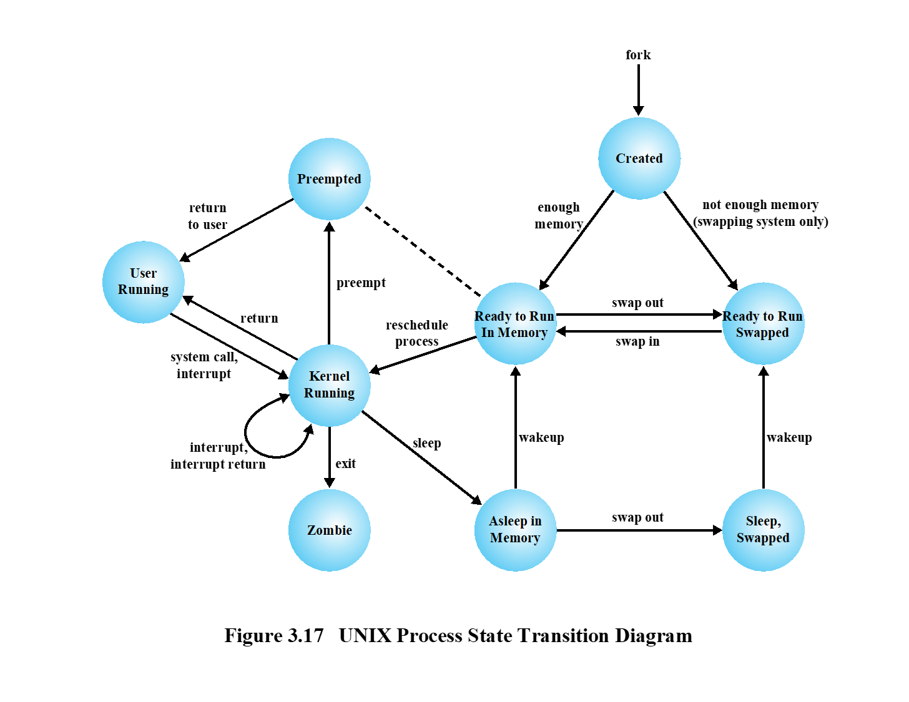

# OS Kernel Simulator

A comprehensive simulation of Operating System kernel operations demonstrating process scheduling, dispatching, memory management, and multi-threading concepts.

**Course**: CS4448 - Operating Systems
**Project**: Implementing a Simulation of Basic Operations of Operating System

---

## Table of Contents

1. [Overview](#1-overview)
2. [System Architecture](#2-system-architecture)
3. [Core Components](#3-core-components)
4. [Process Lifecycle](#4-process-lifecycle)
5. [Scheduling Algorithms](#5-scheduling-algorithms)
6. [Memory Management](#6-memory-management)
7. [Multi-Threading Demonstration](#7-multi-threading-demonstration)
8. [How to Build and Run](#8-how-to-build-and-run)
9. [Sample Output](#9-sample-output)

---

## 1. Overview

This simulator replicates the core functionalities of an operating system kernel:

| Feature | Description |
|---------|-------------|
| **Dispatching** | Allocates CPU to processes, performs context switching |
| **Scheduling** | Implements Round Robin and Priority-based scheduling |
| **State Transitions** | Manages process states (CREATED, READY, RUNNING, etc.) |
| **Memory Management** | Handles memory allocation and swap space |
| **Multi-Threading** | Demonstrates concurrent execution with two threads |

---

## 2. System Architecture

The system follows a layered architecture with clear separation of concerns:

```
┌─────────────────────────────────────────────────────────────────────────────┐
│                              ENTRY POINT                                    │
│                               Main.java                                     │
│         Creates Kernel, Processes, and launches Threads                     │
└─────────────────────────────────────────────────────────────────────────────┘
                                     │
                                     ▼
┌─────────────────────────────────────────────────────────────────────────────┐
│                           THREAD LAYER                                      │
│  ┌─────────────────────────┐       ┌─────────────────────────┐              │
│  │    SchedulerThread      │       │     MonitorThread       │              │
│  │  - Runs scheduling      │       │  - Monitors system      │              │
│  │    cycles               │       │    status               │              │
│  │  - Calls kernel.        │       │  - Prints statistics    │              │
│  │    runCycle()           │       │    periodically         │              │
│  └─────────────────────────┘       └─────────────────────────┘              │
└─────────────────────────────────────────────────────────────────────────────┘
                                     │
                                     ▼
┌─────────────────────────────────────────────────────────────────────────────┐
│                           KERNEL LAYER                                      │
│                            Kernel.java                                      │
│                                                                             │
│   Central coordinator that orchestrates all subsystems:                     │
│   - Process creation (fork, admit)                                          │
│   - Scheduling coordination                                                 │
│   - System call handling                                                    │
│   - Interrupt handling                                                      │
│   - Memory management coordination                                          │
└─────────────────────────────────────────────────────────────────────────────┘
                                     │
            ┌────────────────────────┼────────────────────────┐
            ▼                        ▼                        ▼
┌───────────────────────┐ ┌───────────────────────┐ ┌───────────────────────┐
│   SCHEDULER LAYER     │ │   DISPATCHER LAYER    │ │    MEMORY LAYER       │
│                       │ │                       │ │                       │
│ ┌───────────────────┐ │ │   Dispatcher.java     │ │  MemoryManager.java   │
│ │ RoundRobinScheduler│ │ │                       │ │                       │
│ │ - FIFO queue      │ │ │ - Context switching   │ │ - Memory allocation   │
│ │ - Time quantum    │ │ │ - CPU allocation      │ │ - Swap In/Out         │
│ └───────────────────┘ │ │ - Preemption          │ │                       │
│                       │ │                       │ │  SwapSpace.java       │
│ ┌───────────────────┐ │ │                       │ │ - Track swapped PIDs  │
│ │ PriorityScheduler │ │ │                       │ │                       │
│ │ - 10 priority     │ │ │                       │ │                       │
│ │   levels          │ │ │                       │ │                       │
│ │ - Higher priority │ │ │                       │ │                       │
│ │   runs first      │ │ │                       │ │                       │
│ └───────────────────┘ │ │                       │ │                       │
└───────────────────────┘ └───────────────────────┘ └───────────────────────┘
            │                        │                        │
            └────────────────────────┼────────────────────────┘
                                     ▼
┌─────────────────────────────────────────────────────────────────────────────┐
│                           HANDLER LAYER                                     │
│  ┌─────────────────────────┐       ┌─────────────────────────┐              │
│  │   SystemCallHandler     │       │    InterruptHandler     │              │
│  │  - SYS_READ, WRITE      │       │  - Timer interrupt      │              │
│  │  - SYS_FORK, EXIT       │       │  - I/O completion       │              │
│  │  - SYS_OPEN, CLOSE      │       │  - Page fault           │              │
│  └─────────────────────────┘       └─────────────────────────┘              │
│                                                                             │
│  ┌─────────────────────────┐                                                │
│  │      IOSubsystem        │                                                │
│  │  - Block for I/O        │                                                │
│  │  - Wakeup on completion │                                                │
│  └─────────────────────────┘                                                │
└─────────────────────────────────────────────────────────────────────────────┘
                                     │
                                     ▼
┌─────────────────────────────────────────────────────────────────────────────┐
│                            MODEL LAYER                                      │
│                                                                             │
│  ┌──────────────────┐    ┌──────────────────────────────────────────────┐   │
│  │     Process      │    │         ProcessControlBlock (PCB)            │   │
│  │                  │    │                                              │   │
│  │ - pid, name      │◄───│ - Identifier (pid, parentPid)                │   │
│  │ - priority       │    │ - ProcessState                               │   │
│  │ - state          │    │ - ContextData (registers, SP, flags)         │   │
│  │ - burstTime      │    │ - Priority                                   │   │
│  │ - remainingTime  │    │ - AccountingInformation (CPU time, UID)      │   │
│  │                  │    │ - MemoryPointer (base, limit)                │   │
│  └──────────────────┘    │ - StatusInformationIO (open files)           │   │
│                          └──────────────────────────────────────────────┘   │
│                                                                             │
│  ┌──────────────────────────────────────────────────────────────────────┐   │
│  │                         ProcessState (Enum)                          │   │
│  │  CREATED | READY_MEMORY | READY_SWAPPED | USER_RUNNING |             │   │
│  │  KERNEL_RUNNING | PREEMPTED | SLEEP | SLEEP_SWAPPED | ZOMBIE         │   │
│  └──────────────────────────────────────────────────────────────────────┘   │
└─────────────────────────────────────────────────────────────────────────────┘
                                     │
                                     ▼
┌─────────────────────────────────────────────────────────────────────────────┐
│                         TRANSITION LAYER                                    │
│                                                                             │
│   State transitions are encapsulated in Transition classes:                 │
│                                                                             │
│   Admit      : CREATED → READY_MEMORY                                       │
│   Compute    : Execute CPU cycles                                           │
│   Preempt    : USER_RUNNING → PREEMPTED                                     │
│   Sleep      : KERNEL_RUNNING → SLEEP                                       │
│   WakeUp     : SLEEP → READY_MEMORY                                         │
│   SwapOut    : READY_MEMORY → READY_SWAPPED                                 │
│   SwapIn     : READY_SWAPPED → READY_MEMORY                                 │
│   Exit       : → ZOMBIE                                                     │
│                                                                             │
└─────────────────────────────────────────────────────────────────────────────┘
```

---

## 3. Core Components

### 3.1 Entry Point - Main.java

The entry point initializes the entire simulation:

```java
// Configuration
int timeQuantum = 2;   // 2ms time slice for Round Robin
int maxMemory = 3;     // Max 3 processes in RAM (to demo swap)

// Create kernel
Kernel kernel = new Kernel(timeQuantum, maxMemory);

// Create processes with real data
kernel.createProcess("Chrome",     10, 2);  // 10ms burst, priority 2
kernel.createProcess("VSCode",      8, 1);  // 8ms burst, priority 1 (highest)
kernel.createProcess("Spotify",     6, 3);  // 6ms burst, priority 3
kernel.createProcess("Terminal",    4, 2);  // 4ms burst, priority 2
kernel.createProcess("Calculator",  2, 4);  // 2ms burst, priority 4 (lowest)

// Launch two concurrent threads
SchedulerThread schedulerThread = new SchedulerThread(kernel);
MonitorThread monitorThread = new MonitorThread(kernel, 800);
schedulerThread.start();
monitorThread.start();
```

### 3.2 Kernel - Central Coordinator

The Kernel is the heart of the simulator, coordinating all subsystems:

| Method | Description |
|--------|-------------|
| `createProcess(name, burst, priority)` | Creates a new process and adds to scheduler |
| `runCycle()` | Executes one scheduling cycle (select → dispatch → execute → preempt) |
| `fork(process, parentPid, priority)` | Creates PCB in CREATED state |
| `admit(pcb)` | Transitions CREATED → READY_MEMORY or READY_SWAPPED |
| `schedule()` | Selects next process from scheduler |
| `handleSystemCall(pcb, syscallNum)` | Routes system calls |
| `handleInterrupt(pcb, interruptType)` | Routes interrupts |
| `exit(pcb)` | Terminates process → ZOMBIE |

### 3.3 Dispatcher - CPU Allocation

The Dispatcher handles CPU allocation and context switching:

```
┌─────────────────────────────────────────────────────────┐
│                    DISPATCHER                           │
├─────────────────────────────────────────────────────────┤
│                                                         │
│  dispatchToUser(pcb)                                    │
│  ├── saveContext(oldProcess)   // Save CPU state        │
│  ├── restoreContext(newProcess) // Load new state       │
│  ├── pcb.setState(USER_RUNNING)                         │
│  └── currentProcess = pcb                               │
│                                                         │
│  preempt(pcb)                                           │
│  ├── saveContext(pcb)                                   │
│  └── pcb.setState(PREEMPTED)                            │
│                                                         │
│  contextSwitch(oldPcb, newPcb)                          │
│  ├── Save old process context                           │
│  ├── Restore new process context                        │
│  └── Increment contextSwitchCount                       │
│                                                         │
└─────────────────────────────────────────────────────────┘
```

### 3.4 ProcessManager - Process Lifecycle

Manages process creation and destruction:

```
ProcessManager
│
├── fork(process, parentPid, priority)
│   ├── Allocate new PID
│   ├── Create PCB components:
│   │   ├── Identifier
│   │   ├── AccountingInformation
│   │   ├── StatusInformationIO
│   │   ├── MemoryPointer
│   │   └── ContextData
│   ├── Set state = CREATED
│   └── Add to processTable
│
├── admit(pcb)
│   ├── Check memory availability
│   ├── If available: allocate → READY_MEMORY
│   └── If not: swap out → READY_SWAPPED
│
├── exit(pcb)
│   └── Set state = ZOMBIE
│
└── wait(parentPid, childPid)
    └── Destroy ZOMBIE child, free resources
```

---

## 4. Process Lifecycle

### 4.1 Process States (Based on UNIX Process State Transition Diagram)


```
┌─────────────────────────────────────────────────────────────────────────────┐
│                    UNIX PROCESS STATE TRANSITION DIAGRAM                    │
└─────────────────────────────────────────────────────────────────────────────┘

                                    fork
                                      │
                                      ▼
                               ┌───────────┐
                               │  CREATED  │
                               └─────┬─────┘
                                     │
              ┌──────────────────────┴──────────────────────┐
              │ enough memory                   not enough memory
              ▼                                 (swapping system only)
       ┌─────────────┐                                ▼
       │ READY TO RUN│◄───────── swap in ───── ┌─────────────┐
       │  IN MEMORY  │                         │ READY TO RUN│
       │             │─────── swap out ───────►│   SWAPPED   │
       └──────┬──────┘                         └──────┬──────┘
              │                                       │
              │                                       │ wakeup
              │ preempt (from Kernel Running)         │
              │ . . . . . . . . . . . . .             │
              ▼                         .             │
       ┌───────────┐                    .             │
       │ PREEMPTED │ ◄──── preempt ─────.             │
       └─────┬─────┘                    .             │
             │                          .             │
             │ return to user           .             │
             ▼                          .             │
       ┌─────────────┐                  .             │
       │    USER     │◄── return ──┐    .             │
       │   RUNNING   │             │    .             │
       └──────┬──────┘             │    .             │
              │                    │    .             │
              │ system call,       │    .             │
              │ interrupt          │    .             │
              ▼                    │    .             │
       ┌─────────────┐             │    .             │
       │   KERNEL    │─────────────┘    .             │
       │   RUNNING   │──── preempt ─────┘             │
       │      ↻      │                                │
       │ (interrupt, │──── reschedule ────────────────┘
       │  int return)│        process
       └──────┬──────┘
              │
     ┌────────┼────────┐
     │        │        │
     │ sleep  │        │ exit
     ▼        │        ▼
┌─────────┐   │   ┌─────────┐
│ ASLEEP  │   │   │ ZOMBIE  │
│IN MEMORY│   │   │         │
└────┬────┘   │   └─────────┘
     │        │
     │swap out│
     ▼        │
┌─────────┐   │
│ SLEEP,  │   │
│ SWAPPED │───┘ wakeup
└─────────┘

```

### Key State Transitions:

| From | To | Trigger |
|------|-----|---------|
| — | CREATED | `fork()` |
| CREATED | READY_MEMORY | `admit()` (enough memory) |
| CREATED | READY_SWAPPED | `admit()` (not enough memory) |
| READY_MEMORY | READY_SWAPPED | `swap out` |
| READY_SWAPPED | READY_MEMORY | `swap in` |
| READY_MEMORY | KERNEL_RUNNING | `dispatch` (via preempt path) |
| KERNEL_RUNNING | USER_RUNNING | `return` |
| USER_RUNNING | KERNEL_RUNNING | `system call` / `interrupt` |
| KERNEL_RUNNING | PREEMPTED | `preempt` |
| PREEMPTED | USER_RUNNING | `return to user` |
| KERNEL_RUNNING | READY_MEMORY | `reschedule process` |
| KERNEL_RUNNING | SLEEP | `sleep` (I/O request) |
| KERNEL_RUNNING | ZOMBIE | `exit` |
| SLEEP | READY_MEMORY | `wakeup` |
| SLEEP | SLEEP_SWAPPED | `swap out` |
| SLEEP_SWAPPED | READY_SWAPPED | `wakeup` |

### 4.2 State Descriptions

| State | Description |
|-------|-------------|
| **CREATED** | Process just created via `fork()`, waiting to be admitted |
| **READY_MEMORY** | Ready to run, loaded in main memory (Ready to Run, In Memory) |
| **READY_SWAPPED** | Ready to run, but swapped out to disk (Ready to Run, Swapped) |
| **KERNEL_RUNNING** | Executing kernel code (system call, interrupt, context switch) |
| **USER_RUNNING** | Currently executing user code (returned from kernel) |
| **PREEMPTED** | Preempted by scheduler, waiting to return to user mode |
| **SLEEP** | Blocked waiting for I/O, in memory (Asleep in Memory) |
| **SLEEP_SWAPPED** | Blocked waiting for I/O, swapped out (Sleep, Swapped) |
| **ZOMBIE** | Terminated via `exit()`, waiting for parent to collect status |

### 4.3 Important Notes

1. **All transitions go through KERNEL_RUNNING**: A process must enter kernel mode before changing to any other state
2. **USER_RUNNING never goes directly to ZOMBIE**: It must first enter KERNEL_RUNNING via `exit()` system call
3. **Preemption flow**: USER_RUNNING → KERNEL_RUNNING (interrupt) → PREEMPTED → USER_RUNNING (return)
4. **KERNEL_RUNNING has self-loop**: For handling nested interrupts (interrupt, interrupt return)

---

## 5. Scheduling Algorithms

### 5.1 Round Robin Scheduler

```
┌─────────────────────────────────────────────────────────────────┐
│                    ROUND ROBIN SCHEDULER                        │
├─────────────────────────────────────────────────────────────────┤
│                                                                 │
│  Algorithm: First-In-First-Out with Time Quantum                │
│                                                                 │
│  Configuration:                                                 │
│  - Time Quantum: 2ms (configurable)                             │
│                                                                 │
│  Data Structure:                                                │
│  ┌─────────────────────────────────────────────────────┐        │
│  │ Ready Queue (FIFO):                                 │        │
│  │ [P1] → [P2] → [P3] → [P4] → [P5]                    │        │
│  │  ▲                              │                   │        │
│  │  │      selectNext()            │                   │        │
│  │  │      ◄───────────────────────┘                   │        │
│  │  │                                                  │        │
│  │  └──── requeue() (if not completed)                 │        │
│  └─────────────────────────────────────────────────────┘        │
│                                                                 │
│  Execution Flow:                                                │
│  1. Select process from front of queue                          │
│  2. Execute for time quantum (2ms)                              │
│  3. If not completed, add to back of queue                      │
│  4. If completed, mark as ZOMBIE                                │
│                                                                 │
└─────────────────────────────────────────────────────────────────┘
```

### 5.2 Priority Scheduler

```
┌─────────────────────────────────────────────────────────────────┐
│                    PRIORITY SCHEDULER                           │
├─────────────────────────────────────────────────────────────────┤
│                                                                 │
│  Algorithm: Preemptive Priority with Multiple Queues            │
│                                                                 │
│  Configuration:                                                 │
│  - Priority Levels: 1 (highest) to 10 (lowest)                  │
│  - Time Quantum: 2ms per execution                              │
│                                                                 │
│  Data Structure:                                                │
│  ┌─────────────────────────────────────────────────────┐        │
│  │ Priority Queues:                                    │        │
│  │                                                     │        │
│  │ Priority 1 (Highest): [VSCode] → [...]              │ ◄── Select first   │
│  │ Priority 2:           [Chrome] → [Terminal]         │        │
│  │ Priority 3:           [Spotify]                     │        │
│  │ Priority 4 (Lowest):  [Calculator]                  │        │
│  │ Priority 5-10:        (empty)                       │        │
│  │                                                     │        │
│  └─────────────────────────────────────────────────────┘        │
│                                                                 │
│  Selection: Always pick from highest priority non-empty queue   │
│                                                                 │
│  Example Execution Order:                                       │
│  1. VSCode (P1) - priority 1                                    │
│  2. Chrome (P2) - priority 2                                    │
│  3. Terminal (P4) - priority 2                                  │
│  4. Spotify (P3) - priority 3                                   │
│  5. Calculator (P5) - priority 4                                │
│                                                                 │
└─────────────────────────────────────────────────────────────────┘
```

### 5.3 Scheduling Cycle (runCycle)

```
┌─────────────────────────────────────────────────────────────────┐
│                    SCHEDULING CYCLE                             │
└─────────────────────────────────────────────────────────────────┘

    ┌──────────────┐
    │  runCycle()  │
    └──────┬───────┘
           │
           ▼
    ┌──────────────────────┐
    │ 1. SELECT            │
    │    scheduler.        │
    │    selectNext()      │
    └──────────┬───────────┘
               │
               ▼
    ┌──────────────────────┐
    │ 2. DISPATCH          │
    │    - Set state =     │
    │      USER_RUNNING    │
    │    - Increment       │
    │      context switch  │
    └──────────┬───────────┘
               │
               ▼
    ┌──────────────────────┐
    │ 3. EXECUTE           │
    │    process.execute   │
    │    (timeQuantum)     │
    │    - Decrement       │
    │      remainingTime   │
    └──────────┬───────────┘
               │
               ▼
    ┌──────────────────────┐
    │ 4. CHECK COMPLETION  │
    └──────────┬───────────┘
               │
       ┌───────┴───────┐
       │               │
       ▼               ▼
┌─────────────┐  ┌─────────────┐
│ COMPLETED   │  │ NOT DONE    │
│             │  │             │
│ setState    │  │ setState    │
│ (ZOMBIE)    │  │ (PREEMPTED) │
│             │  │             │
│ Record      │  │ setState    │
│ completion  │  │ (READY_     │
│ time        │  │  MEMORY)    │
│             │  │             │
│             │  │ requeue()   │
└─────────────┘  └─────────────┘
```

---

## 6. Memory Management

### 6.1 Memory Architecture

```
┌─────────────────────────────────────────────────────────────────┐
│                    MEMORY MANAGEMENT                            │
└─────────────────────────────────────────────────────────────────┘

    ┌─────────────────────────────────────────────────────────┐
    │                    MAIN MEMORY                          │
    │                    (3 slots max)                        │
    │  ┌─────────┐  ┌─────────┐  ┌─────────┐                  │
    │  │   P1    │  │   P2    │  │   P3    │                  │
    │  │ Chrome  │  │ VSCode  │  │Spotify  │                  │
    │  │ 1024B   │  │ 1024B   │  │ 1024B   │                  │
    │  └─────────┘  └─────────┘  └─────────┘                  │
    └─────────────────────────────────────────────────────────┘
                              │
                              │ Memory Full?
                              │ New process arrives
                              ▼
    ┌─────────────────────────────────────────────────────────┐
    │                    SWAP SPACE                           │
    │                    (Disk storage)                       │
    │  ┌─────────┐  ┌─────────┐                               │
    │  │   P4    │  │   P5    │                               │
    │  │Terminal │  │  Calc   │                               │
    │  └─────────┘  └─────────┘                               │
    └─────────────────────────────────────────────────────────┘
```

### 6.2 Memory Operations

| Operation | Transition | Description |
|-----------|------------|-------------|
| `allocateMemory(pcb)` | CREATED → READY_MEMORY | Allocates 1KB to process |
| `freeMemory(pcb)` | ZOMBIE → destroyed | Releases allocated memory |
| `swapOut(pcb)` | READY_MEMORY → READY_SWAPPED | Moves process to swap |
| `swapIn(pcb)` | READY_SWAPPED → READY_MEMORY | Loads process from swap |
| `hasAvailableMemory(pcb)` | - | Checks if memory available |

---

## 7. Multi-Threading Demonstration

### 7.1 Thread Architecture

```
┌─────────────────────────────────────────────────────────────────┐
│                    MULTI-THREADING DEMO                         │
└─────────────────────────────────────────────────────────────────┘

         Main Thread
              │
              │ start()
    ┌─────────┴─────────┐
    │                   │
    ▼                   ▼
┌───────────────┐  ┌───────────────┐
│SchedulerThread│  │ MonitorThread │
│   (Thread 1)  │  │   (Thread 2)  │
├───────────────┤  ├───────────────┤
│               │  │               │
│ while(running │  │ while(running │
│   && !empty)  │  │     )         │
│ {             │  │ {             │
│   kernel.     │  │   printSystem │
│   runCycle(); │  │   Status();   │
│               │  │               │
│   sleep(200ms)│  │   sleep(800ms)│
│ }             │  │ }             │
│               │  │               │
└───────────────┘  └───────────────┘
        │                   │
        │                   │
        ▼                   ▼
    ┌───────────────────────────┐
    │         KERNEL            │
    │   (Shared Resource)       │
    │                           │
    │  Protected by             │
    │  ReentrantLock            │
    └───────────────────────────┘
```

### 7.2 Thread Responsibilities

**SchedulerThread:**
- Runs scheduling cycles every 200ms
- Calls `kernel.runCycle()` to execute one scheduling iteration
- Stops when all processes complete (scheduler is empty)

**MonitorThread:**
- Monitors system status every 800ms
- Displays:
  - Simulation time
  - Ready queue size
  - Memory usage (used/max slots)
  - Swap usage
  - Context switch count

### 7.3 Thread Synchronization

All critical sections are protected with `ReentrantLock`:

```java
// Kernel operations
lock.lock();
try {
    // Critical section
    // - Process state changes
    // - Scheduler operations
    // - Memory operations
} finally {
    lock.unlock();
}
```

---

## 8. How to Build and Run

### Requirements

- Java 17 or higher
- Maven 3.8+ (optional)

### Option 1: Using Maven

```bash
# Build
mvn clean compile

# Run
mvn exec:java -Dexec.mainClass="com.ossimulator.Main"

# Or build JAR and run
mvn clean package
java -jar target/os-simulator-1.0.0.jar
```

### Option 2: Using javac directly

```bash
# Compile
cd src/main/java
javac -d ../../../target/classes com/ossimulator/**/*.java

# Run
cd ../../../target/classes
java com.ossimulator.Main
```

### Option 3: Using IDE

1. Open project in IntelliJ IDEA / Eclipse / VS Code
2. Import as Maven project
3. Run `Main.java`

---

## 9. Sample Output

```
+===========================================================+
|              OS KERNEL SIMULATOR                          |
|    Round Robin + Priority Scheduling with Swap            |
|                                                           |
|         Course: CS4448 - Operating Systems                |
+===========================================================+

=== Creating Processes ===

[12:34:56.789] [Kernel      ] Created process: Chrome (PID=1, burst=10ms, priority=2) → READY_MEMORY
[12:34:56.790] [Kernel      ] Created process: VSCode (PID=2, burst=8ms, priority=1) → READY_MEMORY
[12:34:56.791] [Kernel      ] Created process: Spotify (PID=3, burst=6ms, priority=3) → READY_MEMORY
[12:34:56.792] [Kernel      ] Created process: Terminal (PID=4, burst=4ms, priority=2) → READY_SWAPPED
[12:34:56.793] [Kernel      ] Created process: Calculator (PID=5, burst=2ms, priority=4) → READY_SWAPPED

=== Starting Multi-threaded Demo ===
Thread 1: SchedulerThread - runs scheduling cycles
Thread 2: MonitorThread - monitors system status

[Main] Starting threads...
[Main] Main thread ID: 1
[SchedulerThread] Started - Thread ID: 14
[MonitorThread] Started - Thread ID: 15
[Main] Started: SchedulerThread (ID: 14), MonitorThread (ID: 15)

─────────────────────────────────────────────────────────────
[Cycle 1] Process: Chrome
─────────────────────────────────────────────────────────────
[12:34:56.800] [Scheduler   ] [Cycle 1] Selected: Chrome (priority=2, remaining=10ms)
[12:34:56.801] [Dispatcher  ] Context switch: Chrome → KERNEL_RUNNING
[12:34:56.802] [Dispatcher  ] Return to user: Chrome → USER_RUNNING
[12:34:56.803] [Process     ] Chrome executed for 2ms (remaining=8ms)
[12:34:56.804] [Dispatcher  ] Chrome: timer interrupt → KERNEL_RUNNING
[12:34:56.805] [Dispatcher  ] Chrome: preempt → PREEMPTED
[12:34:56.806] [Scheduler   ] Chrome: reschedule → READY_MEMORY (requeued)

+=========================================+
|           SYSTEM MONITOR                |
|   Thread ID: 15                         |
+-----------------------------------------+
|  Simulation Time: 100                ms |
|  Ready Queue Size: 5                    |
|  Memory Usage: 3/3                      |
|  Swap Usage: 2                          |
|  Context Switches: 1                    |
+=========================================+

─────────────────────────────────────────────────────────────
[Cycle 2] Process: VSCode
─────────────────────────────────────────────────────────────
[12:34:57.000] [Scheduler   ] [Cycle 2] Selected: VSCode (priority=1, remaining=8ms)
[12:34:57.001] [Dispatcher  ] Context switch: VSCode → KERNEL_RUNNING
[12:34:57.002] [Dispatcher  ] Return to user: VSCode → USER_RUNNING
[12:34:57.003] [Process     ] VSCode executed for 2ms (remaining=6ms)
[12:34:57.004] [Dispatcher  ] VSCode: timer interrupt → KERNEL_RUNNING
[12:34:57.005] [Dispatcher  ] VSCode: preempt → PREEMPTED
[12:34:57.006] [Scheduler   ] VSCode: reschedule → READY_MEMORY (requeued)
...

─────────────────────────────────────────────────────────────
[Cycle 15] Process: Calculator (COMPLETING)
─────────────────────────────────────────────────────────────
[12:34:59.500] [Scheduler   ] [Cycle 15] Selected: Calculator (priority=4, remaining=2ms)
[12:34:59.501] [Dispatcher  ] Context switch: Calculator → KERNEL_RUNNING
[12:34:59.502] [Dispatcher  ] Return to user: Calculator → USER_RUNNING
[12:34:59.503] [Process     ] Calculator executed for 2ms (remaining=0ms)
[12:34:59.504] [Kernel      ] Calculator: exit() system call → KERNEL_RUNNING
[12:34:59.505] [Kernel      ] Calculator: exit complete → ZOMBIE (turnaround=2700ms)

[SchedulerThread] Finished - Thread ID: 14
[MonitorThread] Finished - Thread ID: 15

[Main] Both threads have finished.
────────────────────────────────────────────────────────────

+===========================================================+
|                 SIMULATION STATISTICS                     |
+===========================================================+
| Total Simulation Time: 2850                            ms |
| Total Cycles: 15                                          |
| Scheduler: Round Robin (quantum=2ms)                      |
| Context Switches: 15                                      |
+-----------------------------------------------------------+
| PROCESS STATISTICS                                        |
+-----------------------------------------------------------+
| Process      | Priority | Burst(ms)  | Turnaround   | State  |
+-----------------------------------------------------------+
| Chrome       | 2        | 10         | 2500         | ZOMBIE |
| VSCode       | 1        | 8          | 2100         | ZOMBIE |
| Spotify      | 3        | 6          | 2300         | ZOMBIE |
| Terminal     | 2        | 4          | 2600         | ZOMBIE |
| Calculator   | 4        | 2          | 2700         | ZOMBIE |
+-----------------------------------------------------------+
| Average Turnaround Time: 2440.00                       ms |
+===========================================================+

+===========================================================+
|                    DEMO COMPLETE                          |
|                                                           |
| This demo showed:                                         |
| 1. Process scheduling with Priority + Round Robin         |
| 2. Context switching via Dispatcher                       |
| 3. Memory management with Swap In/Out                     |
| 4. Correct UNIX state transitions:                        |
|    - READY_MEMORY → KERNEL_RUNNING → USER_RUNNING         |
|    - USER_RUNNING → KERNEL_RUNNING → PREEMPTED            |
|    - USER_RUNNING → KERNEL_RUNNING → ZOMBIE               |
| 5. Two threads running concurrently:                      |
|    - SchedulerThread: executes scheduling cycles          |
|    - MonitorThread: monitors and displays system status   |
+===========================================================+
```

---

## Project Structure

```
os-simulator/
├── pom.xml
├── README.md
├── docs/
│   ├── 1_plan.md
│   ├── 2_implementation.md
│   └── 5_update_log.md
├── logs/
│   └── simulation.log
└── src/main/java/com/ossimulator/
    ├── Main.java                           # Entry point
    │
    ├── manager/                            # Core managers
    │   ├── kernel/
    │   │   └── Kernel.java                 # Central coordinator
    │   ├── dispatcher/
    │   │   └── Dispatcher.java             # CPU allocation
    │   ├── scheduler/
    │   │   ├── Scheduler.java              # Interface
    │   │   ├── RoundRobinScheduler.java    # FIFO + time quantum
    │   │   └── PriorityScheduler.java      # Priority queues
    │   ├── memory/
    │   │   ├── MemoryManager.java          # Memory allocation
    │   │   └── SwapSpace.java              # Swap tracking
    │   ├── process/
    │   │   └── ProcessManager.java         # Process lifecycle
    │   ├── handler/
    │   │   ├── SystemCallHandler.java      # System calls
    │   │   └── InterruptHandler.java       # Interrupts
    │   └── io/
    │       └── IOSubsystem.java            # I/O blocking
    │
    ├── model/                              # Data models
    │   ├── main/
    │   │   ├── Process.java                # Process entity
    │   │   ├── ProcessControlBlock.java    # PCB
    │   │   └── ThreadControlBlock.java     # TCB
    │   └── component/
    │       ├── ProcessState.java           # State enum
    │       ├── Identifier.java             # PID info
    │       ├── Priority.java               # Priority value
    │       ├── ContextData.java            # CPU context
    │       ├── AccountingInformation.java  # Accounting
    │       ├── MemoryPointer.java          # Memory info
    │       ├── StatusInformationIO.java    # I/O status
    │       ├── Program.java                # Instructions
    │       └── ProgramData.java            # Variables
    │
    ├── transition/                         # State transitions
    │   ├── Transition.java                 # Interface
    │   ├── Admit.java
    │   ├── Compute.java
    │   ├── Preempt.java
    │   ├── Sleep.java
    │   ├── WakeUp.java
    │   ├── SwapIn.java
    │   ├── SwapOut.java
    │   ├── Exit.java
    │   └── ...
    │
    ├── thread/                             # Multi-threading
    │   ├── SchedulerThread.java            # Scheduling thread
    │   └── MonitorThread.java              # Monitor thread
    │
    └── util/
        └── Logger.java                     # Logging utility
```

---

## License

This project is developed for educational purposes as part of the CS4448 Operating Systems course.
