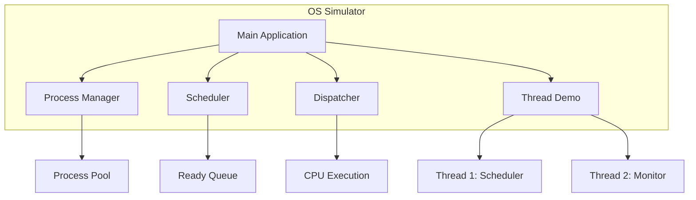
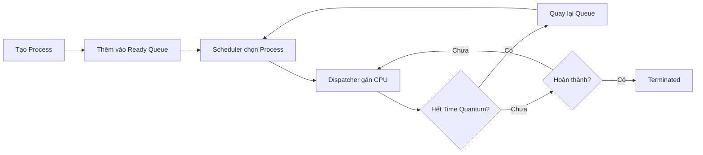
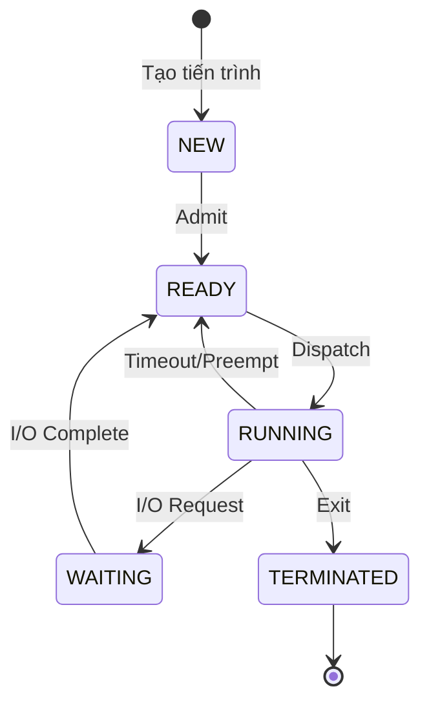
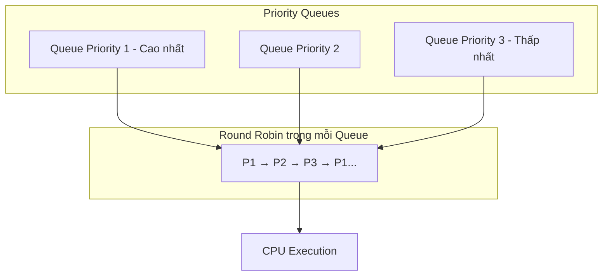
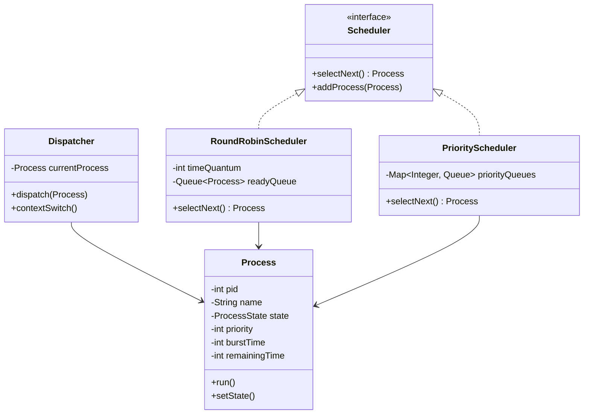
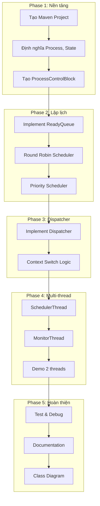
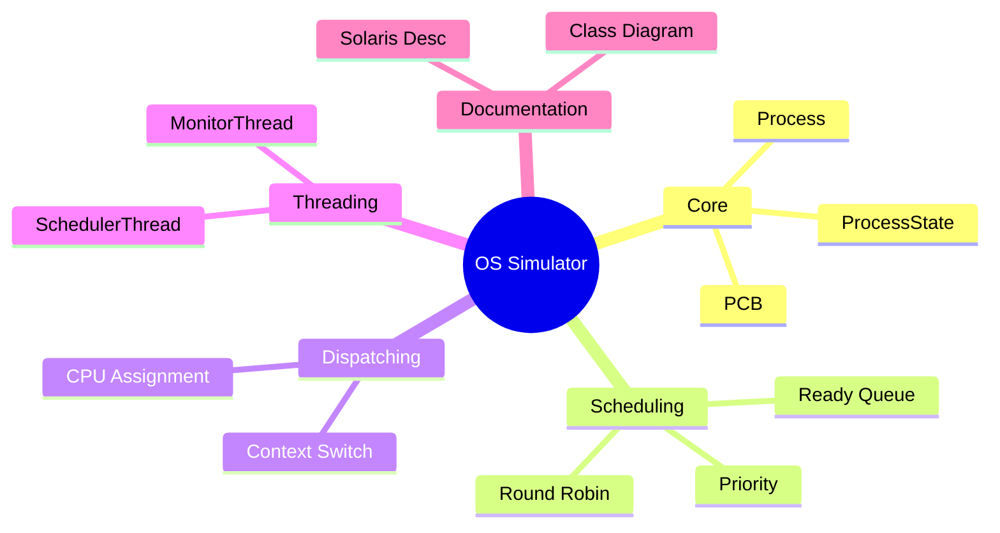

# Kế Hoạch Dự Án: Mô Phỏng Hệ Điều Hành

## 1. Tổng Quan Dự Án

### 1.1 Mục Tiêu
Xây dựng chương trình mô phỏng các hoạt động cơ bản của **kernel** (nhân) hệ điều hành, bao gồm:
- **Dispatching**: Phân phối CPU cho tiến trình
- **Scheduling**: Lập lịch tiến trình (Round Robin + Priority)
- **Process State Transition**: Chuyển đổi trạng thái tiến trình
- **Multi-threading**: Chạy đồng thời nhiều luồng

### 1.2 Giải Thích Thuật Ngữ Cơ Bản

| Thuật Ngữ | Giải Thích Đơn Giản |
|-----------|---------------------|
| **Process (Tiến trình)** | Một chương trình đang chạy. Ví dụ: Chrome, Word đều là các tiến trình |
| **Thread (Luồng)** | Đơn vị thực thi nhỏ hơn trong tiến trình. Một tiến trình có thể có nhiều luồng |
| **CPU** | Bộ xử lý trung tâm - "bộ não" của máy tính, thực hiện các phép tính |
| **Kernel** | Phần lõi của hệ điều hành, quản lý tài nguyên máy tính |
| **Scheduler** | Bộ lập lịch - quyết định tiến trình nào được chạy tiếp theo |
| **Dispatcher** | Bộ phân phối - thực hiện việc chuyển CPU từ tiến trình này sang tiến trình khác |
| **Round Robin** | Thuật toán lập lịch: mỗi tiến trình được chạy một khoảng thời gian bằng nhau |
| **Priority** | Lập lịch theo độ ưu tiên: tiến trình quan trọng hơn chạy trước |

---

## 2. Kiến Trúc Tổng Quan (Top-Down)

### 2.1 Sơ Đồ Mức Cao Nhất



### 2.2 Luồng Hoạt Động Chính



---

## 3. Trạng Thái Tiến Trình (Process States)

### 3.1 Sơ Đồ Chuyển Trạng Thái



### 3.2 Bảng Mô Tả Trạng Thái

| Trạng Thái | Mô Tả | Ví Dụ Thực Tế |
|------------|-------|---------------|
| **NEW** | Tiến trình vừa được tạo | Bạn vừa click mở Chrome |
| **READY** | Sẵn sàng chạy, đang chờ CPU | Chrome đã load xong, chờ đến lượt |
| **RUNNING** | Đang được CPU thực thi | Chrome đang xử lý trang web |
| **WAITING** | Đang chờ I/O (đọc file, mạng) | Chrome đang tải hình ảnh từ mạng |
| **TERMINATED** | Đã kết thúc | Bạn đóng Chrome |

---

## 4. Thuật Toán Lập Lịch

### 4.1 Round Robin với Priority



### 4.2 Ví Dụ Hoạt Động

| Thời điểm | Process | Priority | Trạng thái | Time Quantum |
|-----------|---------|----------|------------|--------------|
| T=0 | P1 | 1 | RUNNING | 2ms |
| T=2 | P2 | 1 | RUNNING | 2ms |
| T=4 | P1 | 1 | RUNNING | 2ms |
| T=6 | P3 | 2 | RUNNING | 2ms |

---

## 5. Cấu Trúc Dự Án

### 5.1 Cấu Trúc Thư Mục

```
os-simulator/
├── pom.xml                          # Maven build file
├── README.md
├── docs/
│   ├── 1_plan.md                    # File này
│   ├── 2_class_diagram.md
│   └── 3_solaris_description.md
└── src/
    └── main/
        └── java/
            └── com/
                └── ossimulator/
                    ├── Main.java
                    ├── core/
                    │   ├── Process.java
                    │   ├── ProcessState.java
                    │   └── ProcessControlBlock.java
                    ├── scheduler/
                    │   ├── Scheduler.java
                    │   ├── RoundRobinScheduler.java
                    │   └── PriorityScheduler.java
                    ├── dispatcher/
                    │   └── Dispatcher.java
                    ├── queue/
                    │   └── ReadyQueue.java
                    └── thread/
                        ├── SchedulerThread.java
                        └── MonitorThread.java
```

### 5.2 Giải Thích Cấu Trúc

| Thư mục/File | Mục đích |
|--------------|----------|
| `pom.xml` | Cấu hình Maven - quản lý build và dependencies |
| `core/` | Các class cốt lõi: Process, trạng thái |
| `scheduler/` | Các thuật toán lập lịch |
| `dispatcher/` | Chuyển CPU giữa các process |
| `queue/` | Hàng đợi Ready |
| `thread/` | Demo chạy đa luồng |

---

## 6. Thiết Kế Class (Class Diagram)



---

## 7. Về Việc Chia Module/Repository

### 7.1 Khuyến Nghị: **KHÔNG CẦN** chia thành nhiều repository

| Lựa chọn | Ưu điểm | Nhược điểm | Khuyến nghị |
|----------|---------|------------|-------------|
| **1 Repository duy nhất** | Đơn giản, dễ quản lý, phù hợp dự án học tập | Ít modular | ✅ **Chọn cái này** |
| Nhiều Repository | Modular hơn | Phức tạp, overkill cho dự án này | ❌ |

### 7.2 Về Maven Modules

```
os-simulator/                    # Single module project
├── pom.xml                      # Parent POM
└── src/...
```

**Lý do:**
- Dự án có scope vừa phải
- Các thành phần liên kết chặt chẽ
- Dễ build và test
- Phù hợp yêu cầu môn học

---

## 8. Kế Hoạch Thực Hiện

### 8.1 Các Bước Triển Khai



### 8.2 Bảng Chi Tiết Công Việc

| Phase | Task | Mô tả | Output |
|-------|------|-------|--------|
| **1** | Setup Maven | Tạo project structure | `pom.xml`, folders |
| **1** | Core classes | Process, ProcessState enum | Java files |
| **2** | Ready Queue | Hàng đợi FIFO các process | `ReadyQueue.java` |
| **2** | Round Robin | Thuật toán RR với time quantum | `RoundRobinScheduler.java` |
| **2** | Priority | Lập lịch theo priority | `PriorityScheduler.java` |
| **3** | Dispatcher | Logic dispatch và context switch | `Dispatcher.java` |
| **4** | Threads | 2 threads chạy song song | Thread demo |
| **5** | Docs | Class diagram, mô tả Solaris | Markdown files |

---

## 9. Yêu Cầu Kỹ Thuật

### 9.1 Công Nghệ Sử Dụng

| Thành phần | Công nghệ | Phiên bản |
|------------|-----------|-----------|
| Ngôn ngữ | Java | 11+ |
| Build tool | Maven | 3.8+ |
| IDE | IntelliJ / Eclipse / VS Code | Any |

### 9.2 Dependencies (pom.xml)

```xml
<!-- Không cần dependencies bên ngoài cho dự án này -->
<!-- Java core là đủ -->
```

---

## 10. Deliverables (Sản Phẩm Bàn Giao)

| # | Sản phẩm | Mô tả |
|---|----------|-------|
| 1 | Source Code | Java code hoàn chỉnh |
| 2 | Class Diagram | Sơ đồ UML các class |
| 3 | Solaris Description | Mô tả chi tiết về Solaris |
| 4 | Demo | Video/Screenshot chạy 2 threads |
| 5 | README | Hướng dẫn build và chạy |

---

## 11. Tóm Tắt



**Kết luận:**
- Sử dụng **1 Maven project duy nhất** (không cần chia repo)
- Cấu trúc package rõ ràng theo chức năng
- Java thuần, không cần dependencies ngoài
- Focus vào simulation logic và multi-threading demo
