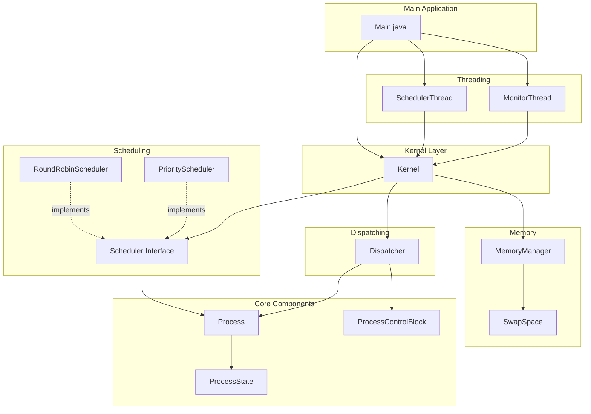

# Hướng Dẫn Implementation Chi Tiết

## 1. Công Nghệ Sử Dụng

### 1.1 Bảng Tổng Hợp

| Thành phần | Lựa chọn | Lý do |
|------------|----------|-------|
| **Ngôn ngữ** | Java 17 | LTS, ổn định, có sẵn concurrency APIs |
| **Build Tool** | Maven 3.9+ | Chuẩn industry, dễ quản lý dependencies |
| **Concurrency** | `java.util.concurrent` | Built-in, thread-safe collections |
| **Logging** | `System.out` + Custom Logger | Đơn giản, không cần thêm dependency |
| **Testing** | JUnit 5 (optional) | Nếu muốn viết unit tests |

### 1.2 Tại Sao Chọn Như Vậy?

```
┌─────────────────────────────────────────────────────────────┐
│                    LỰA CHỌN CÔNG NGHỆ                       │
├─────────────────────────────────────────────────────────────┤
│                                                             │
│  Java 17 thay vì Java 8?                                    │
│  ────────────────────────                                   │
│  • Records (Java 14+) - code ngắn gọn hơn                   │
│  • Switch expressions - dễ đọc hơn                          │
│  • Text blocks - viết output đẹp hơn                        │
│  • Sealed classes - type-safe state machine                 │
│                                                             │
│  Maven thay vì Gradle?                                      │
│  ──────────────────────                                     │
│  • XML config dễ hiểu cho người mới                         │
│  • Phổ biến trong môi trường học tập                        │
│  • Ít "magic", dễ debug                                     │
│                                                             │
│  Không dùng Spring/Framework?                               │
│  ────────────────────────────                               │
│  • Overkill cho simulation project                          │
│  • Che mất logic quan trọng                                 │
│  • Thêm complexity không cần thiết                          │
│                                                             │
└─────────────────────────────────────────────────────────────┘
```

---

## 2. Cấu Trúc Project Chi Tiết

### 2.1 Cây Thư Mục Đầy Đủ

```
os-simulator/
│
├── pom.xml
├── README.md
│
├── docs/
│   ├── 1_plan.md
│   ├── 2_implementation.md          # File này
│   ├── 3_class_diagram.md
│   └── 4_solaris_description.md
│
└── src/
    ├── main/
    │   └── java/
    │       └── com/
    │           └── ossimulator/
    │               │
    │               ├── Main.java                 # Entry point
    │               │
    │               ├── core/                     # Core domain models
    │               │   ├── Process.java
    │               │   ├── ProcessState.java
    │               │   └── ProcessControlBlock.java
    │               │
    │               ├── memory/                   # Memory management
    │               │   ├── MemoryManager.java
    │               │   └── SwapSpace.java
    │               │
    │               ├── scheduler/                # Scheduling algorithms
    │               │   ├── Scheduler.java           (interface)
    │               │   ├── RoundRobinScheduler.java
    │               │   ├── PriorityScheduler.java
    │               │   └── MLFQScheduler.java       (bonus: Multi-Level)
    │               │
    │               ├── dispatcher/               # CPU dispatching
    │               │   └── Dispatcher.java
    │               │
    │               ├── cpu/                      # CPU simulation
    │               │   └── CPU.java
    │               │
    │               ├── kernel/                   # Kernel coordinator
    │               │   └── Kernel.java
    │               │
    │               ├── thread/                   # Multi-threading demo
    │               │   ├── SchedulerThread.java
    │               │   └── MonitorThread.java
    │               │
    │               └── util/                     # Utilities
    │                   ├── Logger.java
    │                   └── SimulationClock.java
    │
    └── test/                                     # (Optional) Unit tests
        └── java/
            └── com/
                └── ossimulator/
                    └── scheduler/
                        └── RoundRobinSchedulerTest.java
```

---

## 3. Implementation Chi Tiết Từng Class

### 3.1 Core Package

#### ProcessState.java

```java
package com.ossimulator.core;

/**
 * Các trạng thái của một Process trong hệ điều hành
 */
public enum ProcessState {
    NEW,            // Vừa được tạo
    READY,          // Sẵn sàng chạy, đang trong ready queue
    RUNNING,        // Đang được CPU thực thi
    WAITING,        // Đang chờ I/O hoặc event
    SWAPPED_READY,  // Bị swap ra disk, sẵn sàng khi swap vào
    SWAPPED_WAITING,// Bị swap ra disk, đang chờ I/O
    TERMINATED      // Đã kết thúc
}
```

#### Process.java

```java
package com.ossimulator.core;

/**
 * Đại diện cho một Process trong hệ thống
 */
public class Process {
    private final int pid;                    // Process ID - không đổi
    private final String name;                // Tên process
    private ProcessState state;               // Trạng thái hiện tại
    private int priority;                     // Độ ưu tiên (1 = cao nhất)

    // CPU burst information
    private final int burstTime;              // Tổng thời gian CPU cần
    private int remainingTime;                // Thời gian còn lại

    // Timing information
    private final long arrivalTime;           // Thời điểm vào hệ thống
    private long startTime;                   // Thời điểm bắt đầu chạy lần đầu
    private long completionTime;              // Thời điểm hoàn thành

    // Memory information
    private int memoryRequired;               // RAM cần dùng (KB)
    private boolean inMainMemory;             // Đang trong RAM hay swap?

    // Constructor
    public Process(int pid, String name, int burstTime, int priority) {
        this.pid = pid;
        this.name = name;
        this.burstTime = burstTime;
        this.remainingTime = burstTime;
        this.priority = priority;
        this.state = ProcessState.NEW;
        this.arrivalTime = System.currentTimeMillis();
        this.memoryRequired = 100; // Default 100KB
        this.inMainMemory = false;
    }

    // === State transitions ===

    public void admit() {
        if (state == ProcessState.NEW) {
            state = ProcessState.READY;
        }
    }

    public void dispatch() {
        if (state == ProcessState.READY) {
            state = ProcessState.RUNNING;
            if (startTime == 0) {
                startTime = System.currentTimeMillis();
            }
        }
    }

    public void preempt() {
        if (state == ProcessState.RUNNING) {
            state = ProcessState.READY;
        }
    }

    public void block() {
        if (state == ProcessState.RUNNING) {
            state = ProcessState.WAITING;
        }
    }

    public void unblock() {
        if (state == ProcessState.WAITING) {
            state = ProcessState.READY;
        }
    }

    public void terminate() {
        state = ProcessState.TERMINATED;
        completionTime = System.currentTimeMillis();
    }

    public void swapOut() {
        if (state == ProcessState.READY) {
            state = ProcessState.SWAPPED_READY;
        } else if (state == ProcessState.WAITING) {
            state = ProcessState.SWAPPED_WAITING;
        }
        inMainMemory = false;
    }

    public void swapIn() {
        if (state == ProcessState.SWAPPED_READY) {
            state = ProcessState.READY;
        } else if (state == ProcessState.SWAPPED_WAITING) {
            state = ProcessState.WAITING;
        }
        inMainMemory = true;
    }

    // === Execute ===

    /**
     * Thực thi process trong một khoảng thời gian
     * @param timeSlice thời gian được cấp (time quantum)
     * @return thời gian thực sự đã dùng
     */
    public int execute(int timeSlice) {
        int actualTime = Math.min(timeSlice, remainingTime);
        remainingTime -= actualTime;
        return actualTime;
    }

    public boolean isCompleted() {
        return remainingTime <= 0;
    }

    // === Getters & Setters ===

    public int getPid() { return pid; }
    public String getName() { return name; }
    public ProcessState getState() { return state; }
    public int getPriority() { return priority; }
    public void setPriority(int priority) { this.priority = priority; }
    public int getBurstTime() { return burstTime; }
    public int getRemainingTime() { return remainingTime; }
    public int getMemoryRequired() { return memoryRequired; }
    public boolean isInMainMemory() { return inMainMemory; }
    public void setInMainMemory(boolean inMainMemory) { this.inMainMemory = inMainMemory; }

    // Metrics
    public long getTurnaroundTime() {
        return completionTime - arrivalTime;
    }

    public long getWaitingTime() {
        return getTurnaroundTime() - burstTime;
    }

    @Override
    public String toString() {
        return String.format("Process[pid=%d, name=%s, state=%s, priority=%d, remaining=%d]",
                pid, name, state, priority, remainingTime);
    }
}
```

#### ProcessControlBlock.java (PCB)

```java
package com.ossimulator.core;

/**
 * Process Control Block - Cấu trúc dữ liệu kernel dùng để quản lý process
 * Trong thực tế, PCB chứa nhiều thông tin hơn Process object
 */
public class ProcessControlBlock {
    // Process identification
    private final int pid;
    private final Process process;

    // CPU state (sẽ được save/restore khi context switch)
    private int programCounter;           // Địa chỉ lệnh tiếp theo
    private int[] registers;              // Giá trị các thanh ghi
    private int stackPointer;             // Con trỏ stack

    // Scheduling information
    private int priority;
    private long cpuTimeUsed;             // Tổng CPU time đã dùng
    private long lastScheduledTime;       // Lần cuối được schedule

    // Memory management
    private int baseRegister;             // Địa chỉ bắt đầu trong memory
    private int limitRegister;            // Giới hạn memory
    private int[] pageTable;              // Bảng page (nếu dùng paging)

    // I/O information
    private int[] openFiles;              // Danh sách file đang mở

    public ProcessControlBlock(Process process) {
        this.pid = process.getPid();
        this.process = process;
        this.priority = process.getPriority();
        this.registers = new int[16];     // Giả lập 16 thanh ghi
        this.programCounter = 0;
        this.stackPointer = 0;
        this.cpuTimeUsed = 0;
    }

    /**
     * Lưu CPU state khi bị preempt
     */
    public void saveContext(int pc, int[] regs, int sp) {
        this.programCounter = pc;
        this.registers = regs.clone();
        this.stackPointer = sp;
    }

    /**
     * Khôi phục CPU state khi được dispatch
     */
    public int[] restoreContext() {
        return new int[] { programCounter, stackPointer };
    }

    public void addCpuTime(long time) {
        cpuTimeUsed += time;
        lastScheduledTime = System.currentTimeMillis();
    }

    // Getters
    public int getPid() { return pid; }
    public Process getProcess() { return process; }
    public int getPriority() { return priority; }
    public void setPriority(int priority) { this.priority = priority; }
    public long getCpuTimeUsed() { return cpuTimeUsed; }
    public int getProgramCounter() { return programCounter; }
}
```

---

### 3.2 Scheduler Package

#### Scheduler.java (Interface)

```java
package com.ossimulator.scheduler;

import com.ossimulator.core.Process;
import java.util.Optional;

/**
 * Interface cho tất cả các thuật toán scheduling
 */
public interface Scheduler {

    /**
     * Thêm process vào ready queue
     */
    void addProcess(Process process);

    /**
     * Chọn process tiếp theo để chạy
     * @return Process được chọn, hoặc empty nếu queue rỗng
     */
    Optional<Process> selectNext();

    /**
     * Kiểm tra queue có rỗng không
     */
    boolean isEmpty();

    /**
     * Lấy số lượng process trong queue
     */
    int size();

    /**
     * Lấy time quantum (cho Round Robin)
     */
    int getTimeQuantum();

    /**
     * Tên thuật toán
     */
    String getName();
}
```

#### RoundRobinScheduler.java

```java
package com.ossimulator.scheduler;

import com.ossimulator.core.Process;
import com.ossimulator.core.ProcessState;

import java.util.LinkedList;
import java.util.Optional;
import java.util.Queue;
import java.util.concurrent.locks.ReentrantLock;

/**
 * Round Robin Scheduler
 * - Mỗi process được chạy một time quantum
 * - Sau đó quay vòng sang process tiếp theo
 * - FIFO trong cùng priority level
 */
public class RoundRobinScheduler implements Scheduler {

    private final Queue<Process> readyQueue;
    private final int timeQuantum;
    private final ReentrantLock lock;

    public RoundRobinScheduler(int timeQuantum) {
        this.readyQueue = new LinkedList<>();
        this.timeQuantum = timeQuantum;
        this.lock = new ReentrantLock();
    }

    @Override
    public void addProcess(Process process) {
        lock.lock();
        try {
            if (process.getState() == ProcessState.NEW) {
                process.admit();
            }
            readyQueue.offer(process);
        } finally {
            lock.unlock();
        }
    }

    @Override
    public Optional<Process> selectNext() {
        lock.lock();
        try {
            Process next = readyQueue.poll();
            return Optional.ofNullable(next);
        } finally {
            lock.unlock();
        }
    }

    /**
     * Đưa process quay lại cuối queue (sau khi hết time quantum)
     */
    public void requeue(Process process) {
        lock.lock();
        try {
            if (!process.isCompleted() && process.getState() == ProcessState.READY) {
                readyQueue.offer(process);
            }
        } finally {
            lock.unlock();
        }
    }

    @Override
    public boolean isEmpty() {
        lock.lock();
        try {
            return readyQueue.isEmpty();
        } finally {
            lock.unlock();
        }
    }

    @Override
    public int size() {
        lock.lock();
        try {
            return readyQueue.size();
        } finally {
            lock.unlock();
        }
    }

    @Override
    public int getTimeQuantum() {
        return timeQuantum;
    }

    @Override
    public String getName() {
        return "Round Robin (quantum=" + timeQuantum + "ms)";
    }
}
```

#### PriorityScheduler.java

```java
package com.ossimulator.scheduler;

import com.ossimulator.core.Process;
import com.ossimulator.core.ProcessState;

import java.util.*;
import java.util.concurrent.locks.ReentrantLock;

/**
 * Priority Scheduler với Round Robin trong mỗi priority level
 * - Priority 1 = cao nhất
 * - Trong cùng priority: Round Robin
 */
public class PriorityScheduler implements Scheduler {

    private static final int MAX_PRIORITY_LEVELS = 10;

    // Mỗi priority level có một queue riêng
    private final Map<Integer, Queue<Process>> priorityQueues;
    private final int timeQuantum;
    private final ReentrantLock lock;

    public PriorityScheduler(int timeQuantum) {
        this.priorityQueues = new HashMap<>();
        this.timeQuantum = timeQuantum;
        this.lock = new ReentrantLock();

        // Khởi tạo queues cho mỗi priority level
        for (int i = 1; i <= MAX_PRIORITY_LEVELS; i++) {
            priorityQueues.put(i, new LinkedList<>());
        }
    }

    @Override
    public void addProcess(Process process) {
        lock.lock();
        try {
            if (process.getState() == ProcessState.NEW) {
                process.admit();
            }

            int priority = Math.min(Math.max(process.getPriority(), 1), MAX_PRIORITY_LEVELS);
            priorityQueues.get(priority).offer(process);
        } finally {
            lock.unlock();
        }
    }

    @Override
    public Optional<Process> selectNext() {
        lock.lock();
        try {
            // Duyệt từ priority cao nhất (1) đến thấp nhất
            for (int priority = 1; priority <= MAX_PRIORITY_LEVELS; priority++) {
                Queue<Process> queue = priorityQueues.get(priority);
                if (!queue.isEmpty()) {
                    return Optional.of(queue.poll());
                }
            }
            return Optional.empty();
        } finally {
            lock.unlock();
        }
    }

    /**
     * Đưa process quay lại queue của nó
     */
    public void requeue(Process process) {
        lock.lock();
        try {
            if (!process.isCompleted() && process.getState() == ProcessState.READY) {
                int priority = process.getPriority();
                priorityQueues.get(priority).offer(process);
            }
        } finally {
            lock.unlock();
        }
    }

    /**
     * Thay đổi priority của process (priority aging)
     */
    public void changePriority(Process process, int newPriority) {
        lock.lock();
        try {
            int oldPriority = process.getPriority();
            Queue<Process> oldQueue = priorityQueues.get(oldPriority);

            if (oldQueue.remove(process)) {
                process.setPriority(newPriority);
                priorityQueues.get(newPriority).offer(process);
            }
        } finally {
            lock.unlock();
        }
    }

    @Override
    public boolean isEmpty() {
        lock.lock();
        try {
            return priorityQueues.values().stream()
                    .allMatch(Queue::isEmpty);
        } finally {
            lock.unlock();
        }
    }

    @Override
    public int size() {
        lock.lock();
        try {
            return priorityQueues.values().stream()
                    .mapToInt(Queue::size)
                    .sum();
        } finally {
            lock.unlock();
        }
    }

    @Override
    public int getTimeQuantum() {
        return timeQuantum;
    }

    @Override
    public String getName() {
        return "Priority Scheduler (quantum=" + timeQuantum + "ms)";
    }

    /**
     * Debug: In trạng thái tất cả queues
     */
    public void printQueues() {
        lock.lock();
        try {
            System.out.println("=== Priority Queues ===");
            for (int i = 1; i <= MAX_PRIORITY_LEVELS; i++) {
                Queue<Process> q = priorityQueues.get(i);
                if (!q.isEmpty()) {
                    System.out.printf("Priority %d: %s%n", i, q);
                }
            }
        } finally {
            lock.unlock();
        }
    }
}
```

---

### 3.3 Dispatcher Package

#### Dispatcher.java

```java
package com.ossimulator.dispatcher;

import com.ossimulator.core.Process;
import com.ossimulator.core.ProcessControlBlock;
import com.ossimulator.core.ProcessState;

import java.util.HashMap;
import java.util.Map;

/**
 * Dispatcher - Chịu trách nhiệm:
 * 1. Context switch giữa các process
 * 2. Chuyển CPU cho process được chọn
 * 3. Lưu/khôi phục trạng thái CPU
 */
public class Dispatcher {

    private Process currentProcess;
    private final Map<Integer, ProcessControlBlock> pcbTable;

    // Simulated CPU registers
    private int programCounter;
    private int[] registers;
    private int stackPointer;

    // Statistics
    private int contextSwitchCount;
    private long totalDispatchTime;

    public Dispatcher() {
        this.pcbTable = new HashMap<>();
        this.registers = new int[16];
        this.contextSwitchCount = 0;
        this.totalDispatchTime = 0;
    }

    /**
     * Đăng ký PCB cho process mới
     */
    public void registerProcess(Process process) {
        ProcessControlBlock pcb = new ProcessControlBlock(process);
        pcbTable.put(process.getPid(), pcb);
    }

    /**
     * Dispatch - Chuyển CPU cho process mới
     * @param nextProcess Process sẽ được chạy
     * @return Process cũ (nếu có)
     */
    public Process dispatch(Process nextProcess) {
        long startTime = System.nanoTime();

        Process previousProcess = currentProcess;

        // 1. Lưu context của process hiện tại (nếu có)
        if (currentProcess != null && currentProcess.getState() == ProcessState.RUNNING) {
            saveContext(currentProcess);
            currentProcess.preempt();  // RUNNING -> READY
        }

        // 2. Context switch
        contextSwitch(nextProcess);

        // 3. Khôi phục context của process mới
        restoreContext(nextProcess);
        nextProcess.dispatch();  // READY -> RUNNING

        currentProcess = nextProcess;
        contextSwitchCount++;

        // Measure dispatch time
        long endTime = System.nanoTime();
        totalDispatchTime += (endTime - startTime);

        printDispatchInfo(previousProcess, nextProcess);

        return previousProcess;
    }

    /**
     * Lưu CPU state vào PCB
     */
    private void saveContext(Process process) {
        ProcessControlBlock pcb = pcbTable.get(process.getPid());
        if (pcb != null) {
            pcb.saveContext(programCounter, registers, stackPointer);
            System.out.printf("  [Dispatcher] Saved context for P%d (PC=%d)%n",
                    process.getPid(), programCounter);
        }
    }

    /**
     * Context switch - Mô phỏng việc chuyển đổi
     */
    private void contextSwitch(Process nextProcess) {
        // Trong thực tế: flush TLB, update memory maps, etc.
        // Ở đây chỉ mô phỏng delay
        try {
            Thread.sleep(1); // Simulate context switch overhead
        } catch (InterruptedException e) {
            Thread.currentThread().interrupt();
        }
    }

    /**
     * Khôi phục CPU state từ PCB
     */
    private void restoreContext(Process process) {
        ProcessControlBlock pcb = pcbTable.get(process.getPid());
        if (pcb != null) {
            int[] state = pcb.restoreContext();
            programCounter = state[0];
            stackPointer = state[1];
            System.out.printf("  [Dispatcher] Restored context for P%d (PC=%d)%n",
                    process.getPid(), programCounter);
        }
    }

    /**
     * In thông tin dispatch
     */
    private void printDispatchInfo(Process prev, Process next) {
        System.out.println("━━━━━━━━━━━━━━━━━━━━━━━━━━━━━━━━━━━━━━━━");
        System.out.printf("  DISPATCH #%d%n", contextSwitchCount);
        if (prev != null) {
            System.out.printf("  Previous: P%d (%s) -> %s%n",
                    prev.getPid(), prev.getName(), prev.getState());
        }
        System.out.printf("  Current:  P%d (%s) -> RUNNING%n",
                next.getPid(), next.getName());
        System.out.println("━━━━━━━━━━━━━━━━━━━━━━━━━━━━━━━━━━━━━━━━");
    }

    public Process getCurrentProcess() {
        return currentProcess;
    }

    public int getContextSwitchCount() {
        return contextSwitchCount;
    }

    public double getAverageDispatchTime() {
        if (contextSwitchCount == 0) return 0;
        return (double) totalDispatchTime / contextSwitchCount / 1_000_000; // Convert to ms
    }
}
```

---

### 3.4 Memory Package

#### MemoryManager.java

```java
package com.ossimulator.memory;

import com.ossimulator.core.Process;

import java.util.*;
import java.util.concurrent.locks.ReentrantLock;

/**
 * Memory Manager - Quản lý RAM và Swap
 */
public class MemoryManager {

    private final int maxMemorySlots;          // Số process tối đa trong RAM
    private final Set<Integer> inMemory;       // PIDs đang trong RAM
    private final SwapSpace swapSpace;         // Swap space
    private final Queue<Integer> lruQueue;     // LRU tracking
    private final ReentrantLock lock;

    // Reference to process table
    private final Map<Integer, Process> processTable;

    public MemoryManager(int maxMemorySlots, Map<Integer, Process> processTable) {
        this.maxMemorySlots = maxMemorySlots;
        this.inMemory = new HashSet<>();
        this.swapSpace = new SwapSpace();
        this.lruQueue = new LinkedList<>();
        this.processTable = processTable;
        this.lock = new ReentrantLock();
    }

    /**
     * Load process vào RAM
     * @return true nếu thành công
     */
    public boolean loadToMemory(Process process) {
        lock.lock();
        try {
            int pid = process.getPid();

            // Đã trong memory rồi
            if (inMemory.contains(pid)) {
                updateLRU(pid);
                return true;
            }

            // Cần swap out nếu memory đầy
            if (inMemory.size() >= maxMemorySlots) {
                if (!swapOutVictim()) {
                    return false;
                }
            }

            // Load vào memory
            inMemory.add(pid);
            lruQueue.offer(pid);
            process.setInMainMemory(true);

            // Nếu đang trong swap, đưa ra
            if (swapSpace.contains(pid)) {
                swapSpace.remove(pid);
                process.swapIn();
            }

            System.out.printf("  [Memory] Loaded P%d to RAM. Memory: %d/%d%n",
                    pid, inMemory.size(), maxMemorySlots);

            return true;

        } finally {
            lock.unlock();
        }
    }

    /**
     * Swap out process ít được dùng nhất (LRU)
     */
    private boolean swapOutVictim() {
        Integer victimPid = lruQueue.poll();
        if (victimPid == null) {
            return false;
        }

        Process victim = processTable.get(victimPid);
        if (victim != null) {
            return swapOut(victim);
        }
        return false;
    }

    /**
     * Swap out một process cụ thể
     */
    public boolean swapOut(Process process) {
        lock.lock();
        try {
            int pid = process.getPid();

            if (!inMemory.contains(pid)) {
                return false;
            }

            inMemory.remove(pid);
            lruQueue.remove(pid);
            swapSpace.add(pid);
            process.swapOut();
            process.setInMainMemory(false);

            System.out.printf("  [Memory] Swapped out P%d. Memory: %d/%d, Swap: %d%n",
                    pid, inMemory.size(), maxMemorySlots, swapSpace.size());

            return true;

        } finally {
            lock.unlock();
        }
    }

    /**
     * Swap in một process
     */
    public boolean swapIn(Process process) {
        return loadToMemory(process);
    }

    /**
     * Update LRU order khi process được access
     */
    public void updateLRU(int pid) {
        lock.lock();
        try {
            lruQueue.remove(pid);
            lruQueue.offer(pid);
        } finally {
            lock.unlock();
        }
    }

    /**
     * Release memory khi process terminate
     */
    public void releaseMemory(Process process) {
        lock.lock();
        try {
            int pid = process.getPid();
            inMemory.remove(pid);
            lruQueue.remove(pid);
            swapSpace.remove(pid);
            System.out.printf("  [Memory] Released memory for P%d%n", pid);
        } finally {
            lock.unlock();
        }
    }

    public boolean isInMemory(int pid) {
        return inMemory.contains(pid);
    }

    public boolean isInSwap(int pid) {
        return swapSpace.contains(pid);
    }

    public int getMemoryUsage() {
        return inMemory.size();
    }

    public int getSwapUsage() {
        return swapSpace.size();
    }

    public void printStatus() {
        System.out.println("┌─────────────────────────────────────┐");
        System.out.println("│         MEMORY STATUS               │");
        System.out.printf("│  RAM:  %d/%d processes              │%n", inMemory.size(), maxMemorySlots);
        System.out.printf("│  Swap: %d processes                 │%n", swapSpace.size());
        System.out.printf("│  In RAM: %s                    │%n", inMemory);
        System.out.printf("│  In Swap: %s                   │%n", swapSpace.getPids());
        System.out.println("└─────────────────────────────────────┘");
    }
}
```

#### SwapSpace.java

```java
package com.ossimulator.memory;

import java.util.HashSet;
import java.util.Set;

/**
 * Swap Space - Mô phỏng vùng swap trên disk
 */
public class SwapSpace {

    private final Set<Integer> swappedProcesses;

    public SwapSpace() {
        this.swappedProcesses = new HashSet<>();
    }

    public void add(int pid) {
        swappedProcesses.add(pid);
    }

    public void remove(int pid) {
        swappedProcesses.remove(pid);
    }

    public boolean contains(int pid) {
        return swappedProcesses.contains(pid);
    }

    public int size() {
        return swappedProcesses.size();
    }

    public Set<Integer> getPids() {
        return new HashSet<>(swappedProcesses);
    }
}
```

---

### 3.5 Kernel Package

#### Kernel.java

```java
package com.ossimulator.kernel;

import com.ossimulator.core.Process;
import com.ossimulator.core.ProcessState;
import com.ossimulator.dispatcher.Dispatcher;
import com.ossimulator.memory.MemoryManager;
import com.ossimulator.scheduler.PriorityScheduler;
import com.ossimulator.scheduler.Scheduler;

import java.util.HashMap;
import java.util.Map;
import java.util.Optional;
import java.util.concurrent.atomic.AtomicBoolean;
import java.util.concurrent.atomic.AtomicInteger;

/**
 * Kernel - Điều phối tất cả các thành phần
 */
public class Kernel {

    // Core components
    private final Map<Integer, Process> processTable;
    private final Scheduler scheduler;
    private final Dispatcher dispatcher;
    private final MemoryManager memoryManager;

    // State
    private final AtomicInteger nextPid;
    private final AtomicBoolean running;
    private int simulationTime;

    // Configuration
    private final int timeQuantum;
    private final int maxMemory;

    public Kernel(int timeQuantum, int maxMemory) {
        this.timeQuantum = timeQuantum;
        this.maxMemory = maxMemory;
        this.processTable = new HashMap<>();
        this.scheduler = new PriorityScheduler(timeQuantum);
        this.dispatcher = new Dispatcher();
        this.memoryManager = new MemoryManager(maxMemory, processTable);
        this.nextPid = new AtomicInteger(1);
        this.running = new AtomicBoolean(false);
        this.simulationTime = 0;
    }

    /**
     * Tạo process mới
     */
    public Process createProcess(String name, int burstTime, int priority) {
        int pid = nextPid.getAndIncrement();
        Process process = new Process(pid, name, burstTime, priority);

        // Đăng ký vào các bảng
        processTable.put(pid, process);
        dispatcher.registerProcess(process);

        // Load vào memory và thêm vào scheduler
        if (memoryManager.loadToMemory(process)) {
            scheduler.addProcess(process);
            System.out.printf("[Kernel] Created process: %s%n", process);
        } else {
            System.out.printf("[Kernel] Failed to load P%d to memory%n", pid);
        }

        return process;
    }

    /**
     * Chạy một chu kỳ scheduling
     */
    public void runCycle() {
        Optional<Process> nextOpt = scheduler.selectNext();

        if (nextOpt.isEmpty()) {
            System.out.println("[Kernel] No process ready to run");
            return;
        }

        Process next = nextOpt.get();

        // Đảm bảo process trong memory
        if (!memoryManager.isInMemory(next.getPid())) {
            memoryManager.swapIn(next);
        }

        // Dispatch
        dispatcher.dispatch(next);

        // Execute
        int executedTime = next.execute(timeQuantum);
        simulationTime += executedTime;
        memoryManager.updateLRU(next.getPid());

        System.out.printf("[Kernel] P%d executed for %dms (remaining: %dms)%n",
                next.getPid(), executedTime, next.getRemainingTime());

        // Xử lý sau khi execute
        if (next.isCompleted()) {
            next.terminate();
            memoryManager.releaseMemory(next);
            System.out.printf("[Kernel] P%d TERMINATED%n", next.getPid());
        } else {
            next.preempt();
            ((PriorityScheduler) scheduler).requeue(next);
        }
    }

    /**
     * Chạy simulation cho đến khi hết process
     */
    public void runSimulation() {
        running.set(true);
        System.out.println("\n========== STARTING SIMULATION ==========\n");

        int cycle = 0;
        while (running.get() && !scheduler.isEmpty()) {
            System.out.printf("%n--- Cycle %d (Time: %dms) ---%n", ++cycle, simulationTime);
            runCycle();

            try {
                Thread.sleep(500); // Slow down for visibility
            } catch (InterruptedException e) {
                Thread.currentThread().interrupt();
                break;
            }
        }

        running.set(false);
        printStatistics();
    }

    public void stop() {
        running.set(false);
    }

    public boolean isRunning() {
        return running.get();
    }

    public void printStatistics() {
        System.out.println("\n========== SIMULATION COMPLETE ==========");
        System.out.printf("Total simulation time: %dms%n", simulationTime);
        System.out.printf("Context switches: %d%n", dispatcher.getContextSwitchCount());
        System.out.printf("Avg dispatch time: %.3fms%n", dispatcher.getAverageDispatchTime());
        memoryManager.printStatus();

        System.out.println("\nProcess Statistics:");
        System.out.println("┌─────┬────────────┬──────────┬─────────────┬──────────────┐");
        System.out.println("│ PID │ Name       │ State    │ Turnaround  │ Waiting Time │");
        System.out.println("├─────┼────────────┼──────────┼─────────────┼──────────────┤");
        for (Process p : processTable.values()) {
            System.out.printf("│ %3d │ %-10s │ %-8s │ %8dms  │ %9dms  │%n",
                    p.getPid(), p.getName(), p.getState(),
                    p.getTurnaroundTime(), p.getWaitingTime());
        }
        System.out.println("└─────┴────────────┴──────────┴─────────────┴──────────────┘");
    }

    // Getters
    public Scheduler getScheduler() { return scheduler; }
    public Dispatcher getDispatcher() { return dispatcher; }
    public MemoryManager getMemoryManager() { return memoryManager; }
    public Map<Integer, Process> getProcessTable() { return processTable; }
}
```

---

### 3.6 Thread Demo Package

#### SchedulerThread.java

```java
package com.ossimulator.thread;

import com.ossimulator.kernel.Kernel;

/**
 * Thread 1: Chạy scheduler loop
 */
public class SchedulerThread extends Thread {

    private final Kernel kernel;
    private volatile boolean running;

    public SchedulerThread(Kernel kernel) {
        super("SchedulerThread");
        this.kernel = kernel;
        this.running = true;
    }

    @Override
    public void run() {
        System.out.println("[SchedulerThread] Started");

        while (running && !kernel.getScheduler().isEmpty()) {
            kernel.runCycle();

            try {
                Thread.sleep(100);
            } catch (InterruptedException e) {
                Thread.currentThread().interrupt();
                break;
            }
        }

        System.out.println("[SchedulerThread] Finished");
    }

    public void stopRunning() {
        running = false;
    }
}
```

#### MonitorThread.java

```java
package com.ossimulator.thread;

import com.ossimulator.kernel.Kernel;

/**
 * Thread 2: Monitor và in trạng thái hệ thống
 */
public class MonitorThread extends Thread {

    private final Kernel kernel;
    private volatile boolean running;
    private final int intervalMs;

    public MonitorThread(Kernel kernel, int intervalMs) {
        super("MonitorThread");
        this.kernel = kernel;
        this.intervalMs = intervalMs;
        this.running = true;
    }

    @Override
    public void run() {
        System.out.println("[MonitorThread] Started");

        while (running) {
            printSystemStatus();

            try {
                Thread.sleep(intervalMs);
            } catch (InterruptedException e) {
                Thread.currentThread().interrupt();
                break;
            }
        }

        System.out.println("[MonitorThread] Finished");
    }

    private void printSystemStatus() {
        System.out.println();
        System.out.println("╔═══════════════════════════════════════╗");
        System.out.println("║        SYSTEM MONITOR                 ║");
        System.out.println("╠═══════════════════════════════════════╣");
        System.out.printf("║  Ready Queue Size: %-18d ║%n", kernel.getScheduler().size());
        System.out.printf("║  Memory Usage: %d/%d                   ║%n",
                kernel.getMemoryManager().getMemoryUsage(), 5);
        System.out.printf("║  Swap Usage: %-24d ║%n",
                kernel.getMemoryManager().getSwapUsage());
        System.out.printf("║  Context Switches: %-18d ║%n",
                kernel.getDispatcher().getContextSwitchCount());
        System.out.println("╚═══════════════════════════════════════╝");
    }

    public void stopRunning() {
        running = false;
    }
}
```

---

### 3.7 Main.java

```java
package com.ossimulator;

import com.ossimulator.core.Process;
import com.ossimulator.kernel.Kernel;
import com.ossimulator.thread.MonitorThread;
import com.ossimulator.thread.SchedulerThread;

/**
 * Entry point - Demo OS Simulator
 */
public class Main {

    public static void main(String[] args) {
        System.out.println("╔═══════════════════════════════════════════════════════════╗");
        System.out.println("║           OS KERNEL SIMULATOR                             ║");
        System.out.println("║    Round Robin + Priority Scheduling with Swap            ║");
        System.out.println("╚═══════════════════════════════════════════════════════════╝");
        System.out.println();

        // Configuration
        int timeQuantum = 2;  // 2ms time quantum
        int maxMemory = 3;    // Max 3 processes in RAM

        // Create kernel
        Kernel kernel = new Kernel(timeQuantum, maxMemory);

        // Create some processes
        System.out.println("=== Creating Processes ===\n");
        kernel.createProcess("Chrome",   10, 2);
        kernel.createProcess("VSCode",    8, 1);  // Highest priority
        kernel.createProcess("Spotify",   6, 3);
        kernel.createProcess("Terminal",  4, 2);
        kernel.createProcess("Calculator",2, 4);  // Lowest priority

        System.out.println("\n=== Starting Multi-threaded Demo ===\n");

        // Option 1: Single-threaded simulation
        // kernel.runSimulation();

        // Option 2: Multi-threaded demo
        runMultiThreadDemo(kernel);
    }

    private static void runMultiThreadDemo(Kernel kernel) {
        // Thread 1: Scheduler
        SchedulerThread schedulerThread = new SchedulerThread(kernel);

        // Thread 2: Monitor
        MonitorThread monitorThread = new MonitorThread(kernel, 500);

        // Start both threads
        schedulerThread.start();
        monitorThread.start();

        System.out.printf("[Main] Started threads: %s, %s%n",
                schedulerThread.getName(), monitorThread.getName());

        // Wait for scheduler to finish
        try {
            schedulerThread.join();
        } catch (InterruptedException e) {
            Thread.currentThread().interrupt();
        }

        // Stop monitor
        monitorThread.stopRunning();
        try {
            monitorThread.join(1000);
        } catch (InterruptedException e) {
            Thread.currentThread().interrupt();
        }

        // Print final statistics
        kernel.printStatistics();
    }
}
```

---

## 4. Maven Configuration

### pom.xml

```xml
<?xml version="1.0" encoding="UTF-8"?>
<project xmlns="http://maven.apache.org/POM/4.0.0"
         xmlns:xsi="http://www.w3.org/2001/XMLSchema-instance"
         xsi:schemaLocation="http://maven.apache.org/POM/4.0.0
                             http://maven.apache.org/xsd/maven-4.0.0.xsd">
    <modelVersion>4.0.0</modelVersion>

    <groupId>com.ossimulator</groupId>
    <artifactId>os-simulator</artifactId>
    <version>1.0.0</version>
    <packaging>jar</packaging>

    <name>OS Kernel Simulator</name>
    <description>Simulation of basic OS kernel operations</description>

    <properties>
        <maven.compiler.source>17</maven.compiler.source>
        <maven.compiler.target>17</maven.compiler.target>
        <project.build.sourceEncoding>UTF-8</project.build.sourceEncoding>
    </properties>

    <build>
        <plugins>
            <!-- Compiler plugin -->
            <plugin>
                <groupId>org.apache.maven.plugins</groupId>
                <artifactId>maven-compiler-plugin</artifactId>
                <version>3.11.0</version>
                <configuration>
                    <source>17</source>
                    <target>17</target>
                </configuration>
            </plugin>

            <!-- JAR plugin with main class -->
            <plugin>
                <groupId>org.apache.maven.plugins</groupId>
                <artifactId>maven-jar-plugin</artifactId>
                <version>3.3.0</version>
                <configuration>
                    <archive>
                        <manifest>
                            <mainClass>com.ossimulator.Main</mainClass>
                        </manifest>
                    </archive>
                </configuration>
            </plugin>

            <!-- Exec plugin for running -->
            <plugin>
                <groupId>org.codehaus.mojo</groupId>
                <artifactId>exec-maven-plugin</artifactId>
                <version>3.1.0</version>
                <configuration>
                    <mainClass>com.ossimulator.Main</mainClass>
                </configuration>
            </plugin>
        </plugins>
    </build>

    <dependencies>
        <!-- JUnit 5 for testing (optional) -->
        <dependency>
            <groupId>org.junit.jupiter</groupId>
            <artifactId>junit-jupiter</artifactId>
            <version>5.10.0</version>
            <scope>test</scope>
        </dependency>
    </dependencies>
</project>
```

---

## 5. Cách Build và Chạy

```bash
# Build project
mvn clean compile

# Chạy chương trình
mvn exec:java

# Hoặc build JAR và chạy
mvn clean package
java -jar target/os-simulator-1.0.0.jar
```

---

## 6. Sơ Đồ Quan Hệ Giữa Các Components



---

## 7. Output Mẫu Khi Chạy

```
╔═══════════════════════════════════════════════════════════╗
║           OS KERNEL SIMULATOR                             ║
║    Round Robin + Priority Scheduling with Swap            ║
╚═══════════════════════════════════════════════════════════╝

=== Creating Processes ===

  [Memory] Loaded P1 to RAM. Memory: 1/3
[Kernel] Created process: Process[pid=1, name=Chrome, state=READY, priority=2, remaining=10]
  [Memory] Loaded P2 to RAM. Memory: 2/3
[Kernel] Created process: Process[pid=2, name=VSCode, state=READY, priority=1, remaining=8]
  [Memory] Loaded P3 to RAM. Memory: 3/3
[Kernel] Created process: Process[pid=3, name=Spotify, state=READY, priority=3, remaining=6]
  [Memory] Swapped out P1. Memory: 2/3, Swap: 1
  [Memory] Loaded P4 to RAM. Memory: 3/3
[Kernel] Created process: Process[pid=4, name=Terminal, state=READY, priority=2, remaining=4]

=== Starting Multi-threaded Demo ===

[Main] Started threads: SchedulerThread, MonitorThread
[SchedulerThread] Started
[MonitorThread] Started

--- Cycle 1 (Time: 0ms) ---
━━━━━━━━━━━━━━━━━━━━━━━━━━━━━━━━━━━━━━━━
  DISPATCH #1
  Current:  P2 (VSCode) -> RUNNING
━━━━━━━━━━━━━━━━━━━━━━━━━━━━━━━━━━━━━━━━
[Kernel] P2 executed for 2ms (remaining: 6ms)

╔═══════════════════════════════════════╗
║        SYSTEM MONITOR                 ║
╠═══════════════════════════════════════╣
║  Ready Queue Size: 4                  ║
║  Memory Usage: 3/3                    ║
║  Swap Usage: 1                        ║
║  Context Switches: 1                  ║
╚═══════════════════════════════════════╝

...
```

---

## 8. Tóm Tắt Implementation

| Component | File | Chức năng chính |
|-----------|------|-----------------|
| **Process** | `Process.java` | Đại diện tiến trình, state transitions |
| **PCB** | `ProcessControlBlock.java` | Lưu CPU context |
| **Scheduler** | `*Scheduler.java` | Chọn process tiếp theo |
| **Dispatcher** | `Dispatcher.java` | Context switch, gán CPU |
| **MemoryManager** | `MemoryManager.java` | Quản lý RAM + Swap |
| **Kernel** | `Kernel.java` | Điều phối tất cả |
| **Threads** | `*Thread.java` | Demo multi-threading |
