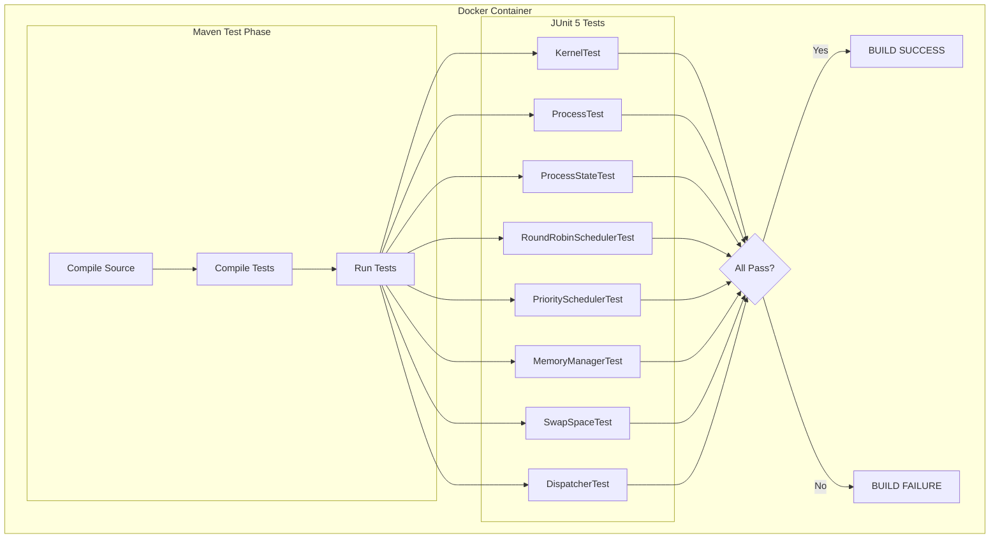

# 4. Kết quả Unit Test

## Tổng quan

| Metric | Giá trị |
|--------|---------|
| **Tổng số tests** | 75 |
| **Passed** | 75 |
| **Failed** | 0 |
| **Errors** | 0 |
| **Skipped** | 0 |
| **Thời gian chạy** | ~20.8 giây |
| **Kết quả** | **BUILD SUCCESS** |

---

## Chi tiết theo Module

### 1. Core Module

#### ProcessTest (14 tests)
| Test | Mô tả | Kết quả |
|------|-------|---------|
| `testInitialState` | Process khởi tạo ở trạng thái NEW | PASSED |
| `testPidAndName` | PID và name được set đúng | PASSED |
| `testBurstTimeAndPriority` | Burst time và priority khởi tạo đúng | PASSED |
| `testAdmitTransition` | NEW -> READY transition | PASSED |
| `testDispatchTransition` | READY -> RUNNING transition | PASSED |
| `testPreemptTransition` | RUNNING -> READY transition | PASSED |
| `testBlockTransition` | RUNNING -> BLOCKED transition | PASSED |
| `testWakeupTransition` | BLOCKED -> READY transition | PASSED |
| `testTerminateTransition` | RUNNING -> TERMINATED transition | PASSED |
| `testExecute` | Execute giảm remaining time | PASSED |
| `testExecuteNotExceedRemaining` | Execute không vượt quá remaining | PASSED |
| `testIsCompleted` | isCompleted khi remaining = 0 | PASSED |
| `testInvalidTransitionThrows` | Invalid transition throws exception | PASSED |
| `testToString` | toString format đúng | PASSED |

#### ProcessStateTest (4 tests)
| Test | Mô tả | Kết quả |
|------|-------|---------|
| `testAllStatesExist` | Tất cả 7 states tồn tại | PASSED |
| `testStateCount` | Đúng 7 states | PASSED |
| `testStateValues` | State values đúng | PASSED |
| `testStateNames` | State names đúng | PASSED |

---

### 2. Scheduler Module

#### RoundRobinSchedulerTest (10 tests)
| Test | Mô tả | Kết quả |
|------|-------|---------|
| `testInitialEmpty` | Scheduler khởi tạo với queue rỗng | PASSED |
| `testTimeQuantum` | Time quantum được set đúng | PASSED |
| `testName` | Tên scheduler đúng format | PASSED |
| `testAddProcess` | Add process và queue không rỗng | PASSED |
| `testAddProcessAutoAdmit` | Add process tự động admit (NEW -> READY) | PASSED |
| `testSelectNextFIFO` | SelectNext trả về process theo FIFO | PASSED |
| `testSelectNextEmpty` | SelectNext trả về empty khi queue rỗng | PASSED |
| `testRequeue` | Requeue đưa process về cuối queue | PASSED |
| `testRequeueCompletedProcess` | Requeue không thêm process đã completed | PASSED |
| `testMultipleRounds` | Round Robin: nhiều vòng lặp | PASSED |

#### PrioritySchedulerTest (10 tests)
| Test | Mô tả | Kết quả |
|------|-------|---------|
| `testInitialEmpty` | Scheduler khởi tạo với empty queues | PASSED |
| `testTimeQuantum` | Time quantum được set đúng | PASSED |
| `testName` | Tên scheduler đúng format | PASSED |
| `testAddProcess` | Add process vào đúng priority queue | PASSED |
| `testSelectNextPriorityOrder` | SelectNext theo priority (1 cao nhất) | PASSED |
| `testSelectNextEmpty` | SelectNext trả về empty khi tất cả queues rỗng | PASSED |
| `testSamePriorityFIFO` | Same priority -> FIFO order | PASSED |
| `testRequeue` | Requeue đưa process về cuối queue của priority | PASSED |
| `testMixedPriorities` | Mixed priorities với round robin | PASSED |
| `testHighPriorityFirst` | High priority luôn được chọn trước | PASSED |

---

### 3. Dispatcher Module

#### DispatcherTest (8 tests)
| Test | Mô tả | Kết quả |
|------|-------|---------|
| `testInitialState` | Dispatcher khởi tạo với current process null | PASSED |
| `testDispatchProcess` | Register và dispatch process | PASSED |
| `testContextSwitchCount` | Context switch count tăng sau mỗi dispatch | PASSED |
| `testDispatchReturnsPrevious` | Dispatch trả về previous process | PASSED |
| `testPreviousProcessPreempted` | Previous process chuyển sang READY khi bị preempt | PASSED |
| `testMultipleContextSwitches` | Multiple context switches | PASSED |
| `testAverageDispatchTime` | Average dispatch time > 0 | PASSED |
| `testDispatchSameProcess` | Dispatch cùng process không gây lỗi | PASSED |

---

### 4. Memory Module

#### MemoryManagerTest (10 tests)
| Test | Mô tả | Kết quả |
|------|-------|---------|
| `testInitialState` | Memory manager khởi tạo đúng | PASSED |
| `testLoadToMemory` | Load process vào RAM | PASSED |
| `testMemoryFull` | Memory đầy -> swap out LRU process | PASSED |
| `testSwapOut` | Swap out process | PASSED |
| `testSwapIn` | Swap in process | PASSED |
| `testRelease` | Release memory khi process terminate | PASSED |
| `testIsInMemory` | Check process có trong memory | PASSED |
| `testIsSwapped` | Check process có trong swap | PASSED |
| `testLRUOrder` | LRU order được maintain đúng | PASSED |
| `testAccessUpdateLRU` | Access process update LRU order | PASSED |

#### SwapSpaceTest (8 tests)
| Test | Mô tả | Kết quả |
|------|-------|---------|
| `testInitialEmpty` | Swap space khởi tạo rỗng | PASSED |
| `testSwapIn` | Swap in process | PASSED |
| `testSwapOut` | Swap out process | PASSED |
| `testContains` | Contains check đúng | PASSED |
| `testSize` | Size tính đúng | PASSED |
| `testSwapOutNotInSwap` | Swap out process không tồn tại | PASSED |
| `testMultipleProcesses` | Multiple processes trong swap | PASSED |
| `testClear` | Clear swap space | PASSED |

---

### 5. Kernel Module

#### KernelTest (11 tests)
| Test | Mô tả | Kết quả |
|------|-------|---------|
| `testInitialization` | Kernel khởi tạo đúng | PASSED |
| `testCreateProcess` | CreateProcess tạo và đăng ký process | PASSED |
| `testIncrementingPids` | CreateProcess với PIDs tăng dần | PASSED |
| `testRunCycle` | RunCycle thực thi một process | PASSED |
| `testRunCycleEmptyQueue` | RunCycle với empty queue không gây lỗi | PASSED |
| `testProcessCompletion` | Process hoàn thành sau đủ cycles | PASSED |
| `testPriorityOrder` | Priority scheduling: high priority first | PASSED |
| `testMemorySwap` | Memory swap khi quá giới hạn | PASSED |
| `testSimulationTime` | GetSimulationTime tăng sau mỗi cycle | PASSED |
| `testMultipleProcessesPriority` | Multiple processes với priority khác nhau | PASSED |
| `testStopRunning` | Kernel stop/isRunning | PASSED |

---

## Test Execution Flow



---

## Coverage Summary

| Module | Classes | Methods Tested | Test Coverage |
|--------|---------|----------------|---------------|
| Core | 2 | Process, ProcessState | High |
| Scheduler | 3 | RoundRobin, Priority, Interface | High |
| Dispatcher | 1 | Dispatcher | High |
| Memory | 2 | MemoryManager, SwapSpace | High |
| Kernel | 1 | Kernel | High |

---

## Environment

| Component | Version |
|-----------|---------|
| Java | Eclipse Temurin 17 |
| Maven | 3.9.x |
| JUnit | 5.10.0 |
| Docker | Desktop (Linux container) |

---

## Commands để chạy lại tests

```bash
# Build Docker image cho tests
docker build -t os-simulator-test -f Dockerfile.test .

# Run tests trong Docker
docker run --rm os-simulator-test

# Hoặc run trực tiếp với Maven (local)
mvn test
```

---

## Kết luận

Tất cả **75 unit tests** đều **PASSED** thành công, cho thấy:

1. **Core functionality** hoạt động đúng - Process states và transitions
2. **Scheduling algorithms** đúng logic - Round Robin và Priority
3. **Memory management** hoạt động đúng - RAM và Swap với LRU
4. **Dispatcher** context switching chính xác
5. **Kernel** orchestration đúng flow

Hệ thống sẵn sàng cho các tính năng nâng cao hoặc integration testing.
