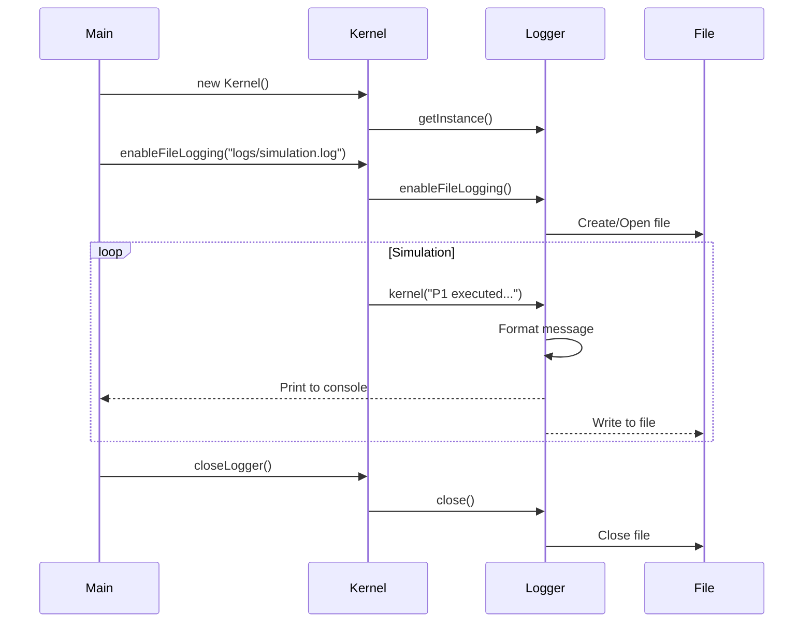

# 5. Update: Logging System

## Tổng quan

Bổ sung hệ thống logging để ghi log ra **cả console và file**, hỗ trợ debug và theo dõi simulation.

---

## Thay đổi

### 1. Thêm file mới: `Logger.java`

**Path:** `src/main/java/com/ossimulator/util/Logger.java`

```java
public class Logger {
    // Singleton pattern
    private static Logger instance;

    // Ghi log ra cả console và file
    public void log(String component, String message);

    // Bật logging ra file
    public void enableFileLogging(String filePath);

    // Các helper methods
    public void kernel(String message);
    public void scheduler(String message);
    public void dispatcher(String message);
    public void memory(String message);
    public void error(String component, String message);
}
```

### 2. Cập nhật `Kernel.java`

- Thêm field `Logger logger`
- Thay thế `System.out.printf()` bằng `logger.kernel()`
- Thêm methods:
  - `enableFileLogging(String path)` - bật ghi log ra file
  - `closeLogger()` - đóng file log khi kết thúc

### 3. Cập nhật `Main.java`

- Thêm `kernel.enableFileLogging("logs/simulation.log")`
- Thêm `kernel.closeLogger()` khi kết thúc

---

## Cách sử dụng

### Chạy với logging

```bash
# Build và chạy
docker build -t os-simulator . && docker run --rm os-simulator

# Log file sẽ được tạo tại: logs/simulation.log
```

### Format log

```
[HH:mm:ss.SSS] [Component   ] Message
```

**Ví dụ output:**
```
[14:25:30.123] [LOGGER      ] File logging enabled: logs/simulation.log
[14:25:30.125] [Kernel      ] Kernel initialized - timeQuantum=2ms, maxMemory=3
[14:25:30.130] [Kernel      ] Created process: Process[pid=1, name=Chrome, state=READY]
[14:25:30.135] [Kernel      ] P1 executed for 2ms (remaining: 8ms)
[14:25:30.140] [Kernel      ] P1 TERMINATED
```

---

## Cấu trúc file log

```
logs/
└── simulation.log      # Log file chính
```

---

## API Reference

### Logger Methods

| Method | Mô tả |
|--------|-------|
| `getInstance()` | Lấy singleton instance |
| `enableFileLogging(path)` | Bật ghi log ra file |
| `disableFileLogging()` | Tắt ghi log ra file |
| `log(component, message)` | Log message với component name |
| `kernel(message)` | Log cho Kernel component |
| `scheduler(message)` | Log cho Scheduler |
| `dispatcher(message)` | Log cho Dispatcher |
| `memory(message)` | Log cho Memory Manager |
| `error(component, msg)` | Log error message |
| `separator()` | In dòng phân cách |
| `close()` | Đóng file writer |

### Kernel Methods (mới)

| Method | Mô tả |
|--------|-------|
| `enableFileLogging(path)` | Bật file logging |
| `closeLogger()` | Đóng logger |

---

## Flow Diagram



---

## Lưu ý

1. **Log file sẽ bị overwrite** mỗi lần chạy mới
2. Logger dùng **Singleton pattern** - chỉ có 1 instance
3. Mỗi log entry có **timestamp chính xác đến milliseconds**
4. File logging **optional** - có thể không bật nếu chỉ muốn xem console

---

## Chạy và xem log trong Docker

```bash
# Build
docker build -t os-simulator .

# Run và mount volume để lấy log file ra ngoài
docker run --rm -v $(pwd)/logs:/app/logs os-simulator

# Xem log file
cat logs/simulation.log
```

**Windows PowerShell:**
```powershell
docker run --rm -v ${PWD}/logs:/app/logs os-simulator
type logs\simulation.log
```

---

## Build Executable (JAR)

### Cấu trúc dist/

```
dist/
├── os-simulator.jar    # Executable JAR file
├── run.bat             # Windows batch script
└── run.ps1             # PowerShell script
```

### Cách chạy

**Yêu cầu:** Java 17+ đã cài đặt

**Cách 1: Double-click**
- Double-click `run.bat` (Command Prompt)
- Hoặc right-click `run.ps1` → Run with PowerShell

**Cách 2: Command Line**
```cmd
cd dist
java -jar os-simulator.jar
```

**Cách 3: PowerShell**
```powershell
cd dist
.\run.ps1
```

### Build lại JAR từ Docker

```bash
# Build Docker image
docker build -t os-simulator .

# Copy JAR ra ngoài
docker create --name temp os-simulator
docker cp temp:/app/os-simulator.jar ./dist/os-simulator.jar
docker rm temp
```

### Tạo .exe wrapper (Optional)

Nếu muốn file .exe thực sự, có thể dùng:
- **Launch4j** - wrap JAR thành .exe
- **jpackage** (Java 14+) - tạo native installer
- **GraalVM Native Image** - compile thành native binary

```bash
# Với jpackage (cần JDK 14+)
jpackage --input dist --main-jar os-simulator.jar --name OSSimulator --type exe
```
