# OS Kernel Simulator - Class Diagram

## Overview

This document presents the class diagram for the OS Kernel Simulator project, which simulates UNIX/SOLARIS process state transitions and scheduling algorithms.

---

## 1. Complete System Architecture


---

## 2. Model Layer - Core Classes

### 2.1 Process and ProcessControlBlock


### 2.2 PCB Components

```mermaid
classDiagram
    class Identifier {
        -int pid
        -int parentPid
        -Process process
        +Identifier(int pid, int parentPid, Process process)
        +getPid() int
        +getParentPid() int
        +getProcess() Process
    }

    class ContextData {
        -int[] registers
        -int stackPointer
        -int flagsRegister
        +ContextData(int[] registers, int stackPointer, int flagsRegister)
        +getRegisters() int[]
        +getStackPointer() int
        +getFlagsRegister() int
        +setRegisters(int[] registers)
        +setStackPointer(int stackPointer)
        +setFlagsRegister(int flagsRegister)
    }

    class AccountingInformation {
        -long cpuTimeUsed
        -long creationTime
        -long lastScheduledTime
        -int uid
        -int gid
        +AccountingInformation()
        +getCpuTimeUsed() long
        +getCreationTime() long
        +setCpuTimeUsed(long time)
    }

    class MemoryPointer {
        -int baseAddress
        -int limitAddress
        -int pageTablePointer
        +MemoryPointer(int baseAddress, int limitAddress)
        +getBaseAddress() int
        +getLimitAddress() int
        +getPageTablePointer() int
    }

    class Priority {
        -int value
        +Priority(int value)
        +getValue() int
        +setValue(int value)
    }

    class StatusInformationIO {
        <<class>>
    }

    class Program {
        <<class>>
    }

    class ProgramData {
        <<class>>
    }
```



---

## 3. Manager Layer

### 3.1 Kernel (Central Manager)

```mermaid
classDiagram
    class Kernel {
        -ProcessManager processManager
        -MemoryManager memoryManager
        -Scheduler priorityScheduler
        -Scheduler roundRobinScheduler
        -Dispatcher dispatcher
        -SystemCallHandler systemCallHandler
        -InterruptHandler interruptHandler
        -IOSubsystem ioSubsystem
        -ReentrantLock lock
        -Logger logger
        -Scheduler activeScheduler
        -ProcessControlBlock runningProcess
        -long simulationStartTime
        -int cycleCount
        -int tickCount
        -List~Process~ allProcesses
        -List~Process~ completedProcesses
        -StateHistoryLogger historyLogger
        -Consumer~String~ stateChangeCallback
        +Kernel(int timeQuantum, long maxMemorySlots)
        +fork(Process, int parentPid, Priority) ProcessControlBlock
        +admit(ProcessControlBlock pcb)
        +schedule()
        +handleSystemCall(ProcessControlBlock pcb, int syscallNumber)
        +handleInterrupt(ProcessControlBlock pcb, int interruptType)
        +timeQuantumExpired(ProcessControlBlock pcb)
        +preemptForHigherPriority(ProcessControlBlock current, ProcessControlBlock higher)
        +returnToUser(ProcessControlBlock pcb)
        +blockingIO(ProcessControlBlock pcb, int deviceId, int operation)
        +reschedule(ProcessControlBlock pcb)
        +exit(ProcessControlBlock pcb)
        +swapOut(ProcessControlBlock pcb)
        +swapIn(ProcessControlBlock pcb)
        +createProcess(String name, int burstTime, int priority) Process
        +runCycle()
        +runCycleWithDelay(int delayMs)
        +setScheduler(SchedulerType type)
        +enableHistoryLogging(String filePath)
        +printStatistics()
    }

    class SchedulerType {
        <<enumeration>>
        PRIORITY
        ROUND_ROBIN
    }

    Kernel +-- SchedulerType
```

### 3.2 Process Manager


### 3.3 Memory Manager


### 3.4 Scheduler Interface and Implementations


### 3.5 Dispatcher


### 3.6 Handlers

```mermaid
classDiagram
    class SystemCallHandler {
        -ReentrantLock lock
        +SystemCallHandler()
        +handleSystemCall(ProcessControlBlock pcb, int syscallNumber)
        +returnFromSyscall(ProcessControlBlock pcb)
        -handleRead(ProcessControlBlock pcb)
        -handleWrite(ProcessControlBlock pcb)
        -handleOpen(ProcessControlBlock pcb)
        -handleClose(ProcessControlBlock pcb)
        -handleFork(ProcessControlBlock pcb)
        -handleExit(ProcessControlBlock pcb)
        -handleWait(ProcessControlBlock pcb)
    }

    class SyscallNumbers {
        <<static>>
        +int SYS_READ$
        +int SYS_WRITE$
        +int SYS_OPEN$
        +int SYS_CLOSE$
        +int SYS_FORK$
        +int SYS_EXIT$
        +int SYS_WAIT$
    }

    class InterruptHandler {
        -Dispatcher dispatcher
        -ReentrantLock lock
        +InterruptHandler(Dispatcher dispatcher)
        +handleInterrupt(ProcessControlBlock pcb, int interruptType)
        +interruptReturn(ProcessControlBlock pcb)
        +preemptForHigherPriority(ProcessControlBlock currentPcb, ProcessControlBlock higherPriorityPcb)
        -handleTimerInterrupt(ProcessControlBlock pcb)
        -handleIOInterrupt(ProcessControlBlock pcb)
        -handlePageFault(ProcessControlBlock pcb)
        -handleHardwareInterrupt(ProcessControlBlock pcb)
    }

    class InterruptTypes {
        <<static>>
        +int TIMER$
        +int IO_COMPLETE$
        +int PAGE_FAULT$
        +int HARDWARE$
    }

    SystemCallHandler +-- SyscallNumbers
    InterruptHandler +-- InterruptTypes
    InterruptHandler --> Dispatcher
```

### 3.7 I/O Subsystem

```mermaid
classDiagram
    class IOSubsystem {
        -Queue~ProcessControlBlock~ ioWaitQueue
        -Map~Integer, IORequest~ pendingRequests
        -MemoryManager memoryManager
        -ReentrantLock lock
        +IOSubsystem(MemoryManager memoryManager)
        +blockForIO(ProcessControlBlock pcb, int deviceId, int operation)
        +wakeup(ProcessControlBlock pcb)
        +ioComplete(int pid)
        +swapOutSleeping(ProcessControlBlock pcb)
        +getWaitingCount() int
        +isWaitingForIO(int pid) boolean
        +getIoWaitQueue() Queue~ProcessControlBlock~
    }

    class IORequest {
        -int pid
        -int deviceId
        -int operation
        -long timestamp
        +IORequest(int pid, int deviceId, int operation)
        +getPid() int
        +getDeviceId() int
        +getOperation() int
        +getTimestamp() long
    }

    class IOOperations {
        <<static>>
        +int READ$
        +int WRITE$
    }

    IOSubsystem +-- IORequest
    IOSubsystem +-- IOOperations
    IOSubsystem --> MemoryManager
```

---

## 4. Transition Layer


---

## 5. Utility Classes

```mermaid
classDiagram
    class Logger {
        <<singleton>>
        -PrintWriter fileWriter
        -boolean fileLoggingEnabled
        -Logger instance$
        -Logger()
        +getInstance()$ Logger
        +kernel(String format, Object... args)
        +scheduler(String format, Object... args)
        +dispatcher(String format, Object... args)
        +process(String format, Object... args)
        +memory(String format, Object... args)
        +io(String format, Object... args)
        +separator()
        +enableFileLogging(String filePath)
        +close()
    }

    class StateHistoryLogger {
        -List~TickSnapshot~ history
        -String logFilePath
        -int currentTick
        -PrintWriter writer
        +StateHistoryLogger(String logFilePath)
        +logStateTransition(int tick, String processName, ProcessState fromState, ProcessState toState, String reason)
        +logTickSnapshot(int tick, List~Process~ processes, String event)
        +logExecution(int tick, String processName, int executedTime, int remainingTime)
        +log(String message)
        +writeSummary(List~Process~ processes, int totalCycles, long simulationTime, int contextSwitches)
        +close()
        +getHistory() List~TickSnapshot~
    }

    class TickSnapshot {
        +int tick
        +String event
        +List~ProcessSnapshot~ processStates
        +TickSnapshot(int tick, String event)
    }

    class ProcessSnapshot {
        +int pid
        +String name
        +int priority
        +int remainingTime
        +ProcessState state
        +boolean inMemory
        +ProcessSnapshot(...)
    }

    StateHistoryLogger +-- TickSnapshot
    StateHistoryLogger +-- ProcessSnapshot
```

---

## 6. GUI and Thread Classes


---

## 7. Package Structure

```
com.ossimulator
├── Main.java
├── gui
│   └── SimulatorApp.java
├── manager
│   ├── dispatcher
│   │   └── Dispatcher.java
│   ├── handler
│   │   ├── InterruptHandler.java
│   │   └── SystemCallHandler.java
│   ├── io
│   │   └── IOSubsystem.java
│   ├── kernel
│   │   └── Kernel.java
│   ├── memory
│   │   ├── MemoryManager.java
│   │   └── SwapSpace.java
│   ├── process
│   │   └── ProcessManager.java
│   └── scheduler
│       ├── PriorityScheduler.java
│       ├── RoundRobinScheduler.java
│       └── Scheduler.java
├── model
│   ├── component
│   │   ├── AccountingInformation.java
│   │   ├── ContextData.java
│   │   ├── Identifier.java
│   │   ├── MemoryPointer.java
│   │   ├── Priority.java
│   │   ├── ProcessState.java
│   │   ├── Program.java
│   │   ├── ProgramCounter.java
│   │   ├── ProgramData.java
│   │   └── StatusInformationIO.java
│   └── main
│       ├── Process.java
│       ├── ProcessControlBlock.java
│       └── ThreadControlBlock.java
├── thread
│   ├── MonitorThread.java
│   └── SchedulerThread.java
├── transition
│   ├── Admit.java
│   ├── AdmitSwapped.java
│   ├── Compute.java
│   ├── Exit.java
│   ├── Fork.java
│   ├── InteruptReturn.java
│   ├── IORequest.java
│   ├── Preempt.java
│   ├── RescheduleProcess.java
│   ├── Return.java
│   ├── ReturnToUser.java
│   ├── Sleep.java
│   ├── SwapIn.java
│   ├── SwapOut.java
│   ├── SystemCall.java
│   ├── Transition.java
│   ├── WakeUp.java
│   └── WakeUpSwapped.java
└── util
    ├── Logger.java
    └── StateHistoryLogger.java
```

---

## 8. Key Relationships Summary

| Relationship Type | From | To | Description |
|------------------|------|-----|-------------|
| Composition | Kernel | ProcessManager | Kernel owns ProcessManager |
| Composition | Kernel | MemoryManager | Kernel owns MemoryManager |
| Composition | Kernel | Dispatcher | Kernel owns Dispatcher |
| Composition | ProcessControlBlock | ContextData | PCB contains context data |
| Composition | ProcessControlBlock | Identifier | PCB contains identifier |
| Aggregation | MemoryManager | SwapSpace | Memory manager uses swap space |
| Implementation | RoundRobinScheduler | Scheduler | Implements Scheduler interface |
| Implementation | PriorityScheduler | Scheduler | Implements Scheduler interface |
| Implementation | Admit | Transition | Implements Transition interface |
| Dependency | InterruptHandler | Dispatcher | Uses dispatcher for preemption |
| Dependency | IOSubsystem | MemoryManager | Uses memory manager for swapping |

---

## 9. Design Patterns Used

| Pattern | Implementation | Purpose |
|---------|---------------|---------|
| **Singleton** | Logger | Single logging instance across application |
| **Strategy** | Scheduler interface | Interchangeable scheduling algorithms |
| **State** | ProcessState enum | Process state management |
| **Command** | Transition interface | Encapsulate state transitions |
| **Observer** | stateChangeCallback | Notify GUI of state changes |
| **Facade** | Kernel | Simplified interface to subsystems |

