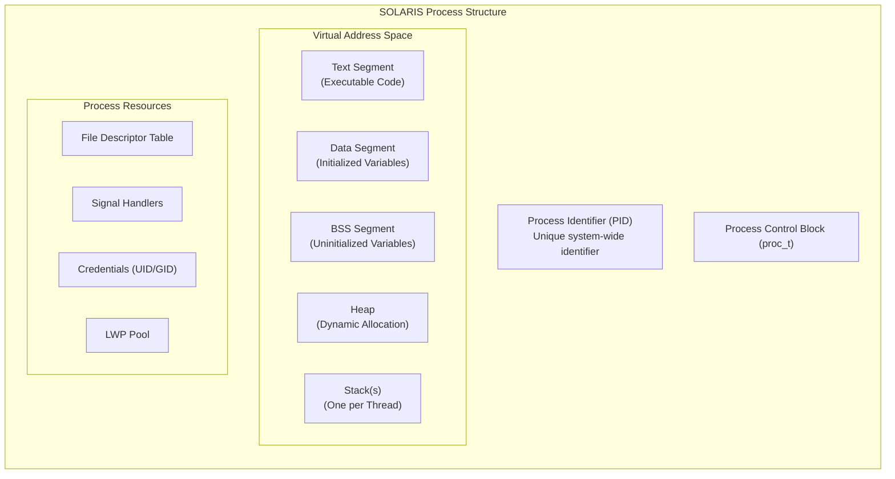
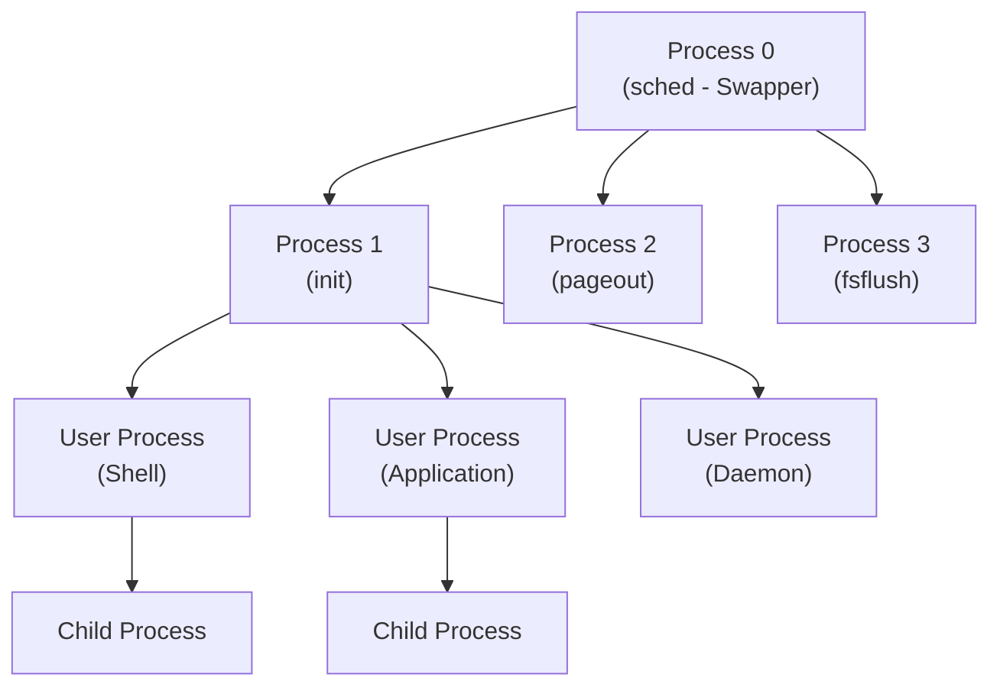
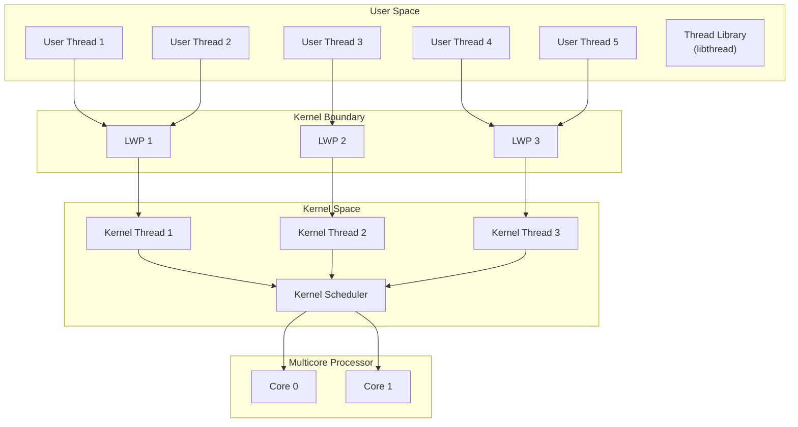
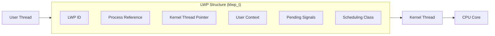
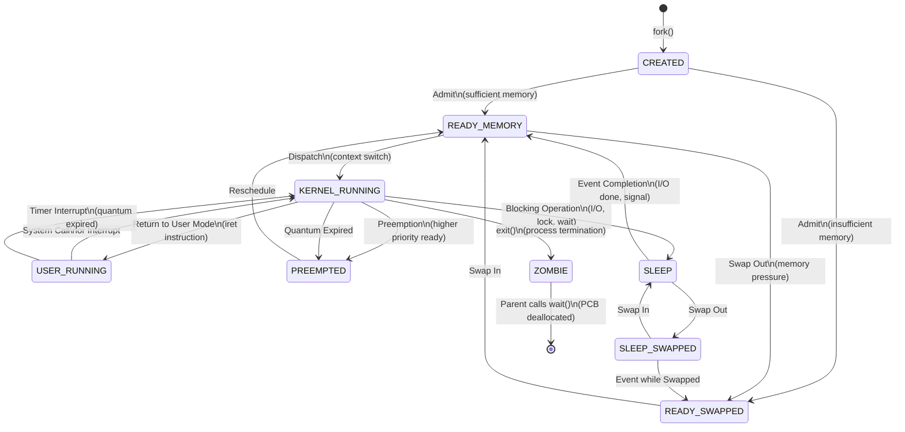
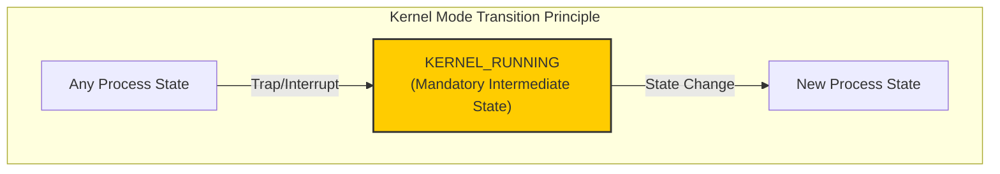
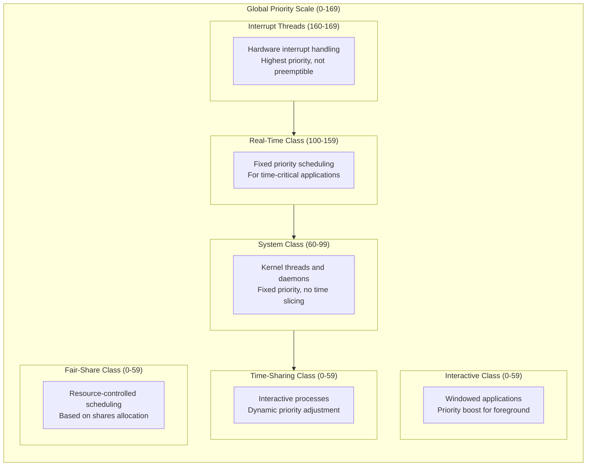
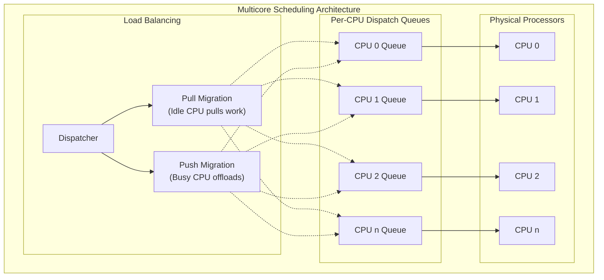

# Process Execution in SOLARIS Operating System
## A Comprehensive Analysis of Multiprocess and Multithread Execution in Multicore Systems

**Course:** CS4448 - Operating Systems
**Institution:** Hanoi University of Science and Technology
**Date:** January 2026

---

## Abstract

This document presents a detailed analysis of process and thread execution in the SOLARIS operating system, with particular emphasis on multicore architectures. SOLARIS, developed by Sun Microsystems (now Oracle), implements a sophisticated two-level thread model and a comprehensive nine-state process lifecycle that serves as a reference implementation for modern operating systems. This study examines the mechanisms by which SOLARIS manages concurrent execution of multiple processes and threads across multiple processor cores, including process creation, thread management, state transitions, and scheduling algorithms.

---

## Table of Contents

1. [Introduction](#1-introduction)
2. [SOLARIS Process Model](#2-solaris-process-model)
3. [SOLARIS Thread Model](#3-solaris-thread-model)
4. [Process State Transitions](#4-process-state-transitions)
5. [Multicore Scheduling Architecture](#5-multicore-scheduling-architecture)
6. [Conclusion](#6-conclusion)
7. [References](#7-references)

---

## 1. Introduction

### 1.1 Background

SOLARIS is a UNIX-based operating system that has been instrumental in advancing operating system design, particularly in the areas of symmetric multiprocessing (SMP), thread management, and enterprise-grade reliability. Originally developed by Sun Microsystems in 1992, SOLARIS has evolved to become one of the most sophisticated commercial operating systems, now maintained by Oracle Corporation.

The study of SOLARIS process execution is particularly relevant because it implements concepts that have been adopted by many modern operating systems, including Linux and modern Windows variants. Understanding how SOLARIS manages processes and threads in multicore environments provides valuable insights into operating system design principles.

### 1.2 Key Characteristics of SOLARIS

| Characteristic | Description |
|----------------|-------------|
| **Kernel Architecture** | Fully preemptible, multithreaded monolithic kernel |
| **Thread Model** | Two-level model with user threads, LWPs, and kernel threads |
| **Scheduling** | Class-based priority scheduling with multiple scheduling classes |
| **Memory Model** | Virtual memory with demand paging and copy-on-write optimization |
| **Scalability** | Supports systems from single processor to thousands of cores |
| **Standards Compliance** | POSIX-compliant, UNIX 03 certified |

### 1.3 Scope of Analysis

This document examines:
- The structure and lifecycle of SOLARIS processes
- The two-level thread model and its implications for multicore execution
- The nine-state process state transition model
- Scheduling mechanisms for multicore systems
- The relationship between user-level and kernel-level execution contexts

---

## 2. SOLARIS Process Model

### 2.1 Definition and Structure

In SOLARIS, a **process** is defined as an instance of a program in execution, encompassing all resources necessary for program execution. Unlike simpler operating systems, SOLARIS processes are designed as containers that can hold multiple threads of execution, each capable of independent scheduling on multicore systems.



### 2.2 Process Control Block (PCB)

The Process Control Block in SOLARIS, implemented as the `proc_t` structure, contains comprehensive information required for process management:

| PCB Component | Description | Purpose |
|---------------|-------------|---------|
| **Process Identification** | PID, PPID, PGID, SID | Unique identification and process hierarchy |
| **Process State** | Current state in lifecycle | Scheduling decisions |
| **CPU Context** | Registers, program counter, stack pointer | Context switching |
| **Memory Management** | Page tables, memory maps | Address translation |
| **Scheduling Information** | Priority, scheduling class, CPU time | Scheduler decisions |
| **Credentials** | UID, GID, capabilities | Security and access control |
| **Resource Limits** | CPU time, memory, file descriptors | Resource management |
| **Accounting Information** | CPU usage, creation time | System accounting |

### 2.3 Process Creation Mechanism

SOLARIS implements process creation through the `fork()` system call, following the traditional UNIX model with significant optimizations.

**fork() Process Creation Steps:**

1. Parent process invokes `fork()` system call
2. Kernel allocates new PID for child process
3. Kernel creates new `proc_t` structure (PCB)
4. Kernel copies parent's PCB to child
5. Memory Manager sets up Copy-on-Write mappings
6. Child inherits file descriptors and signal handlers
7. Kernel creates initial LWP for child
8. `fork()` returns child PID to parent, returns 0 to child
9. Both processes execute concurrently

**Copy-on-Write (COW) Optimization:** SOLARIS employs copy-on-write semantics during fork(), where parent and child initially share physical memory pages marked as read-only. Physical copying occurs only when either process attempts to modify a shared page, significantly reducing the overhead of process creation.

### 2.4 Process Hierarchy and Relationships

SOLARIS maintains a hierarchical process structure rooted at process 0 (the scheduler/swapper):



### 2.5 Process Lifecycle System Calls

| System Call | Function | Description |
|-------------|----------|-------------|
| `fork()` | Create process | Creates exact copy of calling process |
| `exec()` | Load program | Replaces process image with new program |
| `exit()` | Terminate | Terminates process, releases resources |
| `wait()` | Synchronize | Parent waits for child termination |
| `getpid()` | Identification | Returns process ID |
| `getppid()` | Identification | Returns parent process ID |

---

## 3. SOLARIS Thread Model

### 3.1 Two-Level Thread Architecture

SOLARIS implements a sophisticated **two-level thread model** (also known as the M:N model) that provides flexibility and efficiency in thread management. This model distinguishes between three types of execution contexts:



### 3.2 Thread Type Characteristics

| Attribute | User Thread | Lightweight Process (LWP) | Kernel Thread |
|-----------|-------------|---------------------------|---------------|
| **Management** | Thread library | Kernel | Kernel |
| **Visibility** | Application only | Kernel visible | Kernel only |
| **Creation Cost** | Very low | Medium | Medium |
| **Context Switch** | Fast (user space) | Slow (kernel mode) | Slow (kernel mode) |
| **Scheduling** | Thread library | Kernel scheduler | Kernel scheduler |
| **Blocking** | May block LWP | Blocks kernel thread | Blocks CPU |
| **Parallelism** | Limited by LWPs | True parallelism | True parallelism |

### 3.3 Lightweight Processes (LWPs)

LWPs serve as the bridge between user threads and kernel threads, providing several critical functions:

1. **Kernel Execution Context:** Each LWP provides a context for executing system calls on behalf of user threads.

2. **Scheduling Entity:** LWPs are the entities scheduled by the kernel, allowing true parallel execution on multicore systems.

3. **Signal Delivery:** Signals are delivered to LWPs, which then dispatch them to appropriate user threads.

4. **Resource Accounting:** CPU time and other resources are accounted at the LWP level.



### 3.4 Thread Synchronization Primitives

SOLARIS provides multiple synchronization primitives for coordinating thread execution:

| Primitive | Scope | Use Case |
|-----------|-------|----------|
| **Mutex Locks** | Process/System | Mutual exclusion for critical sections |
| **Condition Variables** | Process | Thread coordination and signaling |
| **Semaphores** | Process/System | Resource counting and synchronization |
| **Reader-Writer Locks** | Process | Multiple readers, exclusive writers |
| **Barriers** | Process | Synchronization points for thread groups |

### 3.5 Thread Creation and Management

**Thread Creation Steps (pthread_create):**

1. Application calls `pthread_create()`
2. Thread library allocates thread stack
3. Thread library initializes thread context
4. If needed, library requests new LWP via `lwp_create()`
5. Kernel allocates kernel thread for LWP
6. Library maps user thread to LWP
7. Thread ID returned to application
8. Thread executes concurrently with other threads

**Thread Termination Steps (pthread_join):**

1. Application calls `pthread_join()`
2. Thread library waits for thread completion
3. Library collects exit status
4. Resources deallocated
5. Control returns to caller

---

## 4. Process State Transitions

### 4.1 The Nine-State Model

SOLARIS implements a comprehensive nine-state process model that accurately reflects the various conditions a process may experience during its lifecycle. This model is more detailed than simpler five-state models and accounts for memory management states.



### 4.2 State Definitions

| State | Memory Location | CPU Assigned | Description |
|-------|-----------------|--------------|-------------|
| **CREATED** | N/A | No | Process structure created; resources being allocated |
| **READY_MEMORY** | Main Memory | No | Ready to execute; waiting for CPU assignment |
| **READY_SWAPPED** | Swap Space | No | Ready to execute; swapped out due to memory pressure |
| **KERNEL_RUNNING** | Main Memory | Yes | Executing in kernel mode (privileged) |
| **USER_RUNNING** | Main Memory | Yes | Executing in user mode (unprivileged) |
| **PREEMPTED** | Main Memory | No | Execution interrupted; will resume when rescheduled |
| **SLEEP** | Main Memory | No | Blocked waiting for event (I/O, lock, signal) |
| **SLEEP_SWAPPED** | Swap Space | No | Blocked and swapped out |
| **ZOMBIE** | N/A | No | Terminated; awaiting parent to collect exit status |

### 4.3 Critical Transition: Kernel Mode Requirement

A fundamental principle in SOLARIS (and UNIX systems generally) is that **all state transitions must pass through kernel mode**. This design ensures:

1. **Security:** Only privileged kernel code can modify process states
2. **Resource Management:** Kernel maintains consistent resource accounting
3. **Synchronization:** State changes are atomic and properly synchronized
4. **Audit Trail:** All transitions can be logged for security purposes



### 4.4 State Transition Scenarios

**Scenario 1: Normal Process Execution Cycle**
```
READY_MEMORY → KERNEL_RUNNING → USER_RUNNING → KERNEL_RUNNING → PREEMPTED → READY_MEMORY
```
This cycle represents normal time-sharing where a process executes until its quantum expires.

**Scenario 2: I/O Operation**
```
USER_RUNNING → KERNEL_RUNNING → SLEEP → READY_MEMORY → KERNEL_RUNNING → USER_RUNNING
```
Process blocks on I/O, sleeps until completion, then resumes execution.

**Scenario 3: Process Termination**
```
USER_RUNNING → KERNEL_RUNNING → ZOMBIE → [Destroyed]
```
Process calls exit(), enters zombie state until parent collects status.

**Scenario 4: Memory Pressure**
```
READY_MEMORY → READY_SWAPPED → READY_MEMORY → KERNEL_RUNNING
```
Process swapped out due to memory pressure, later swapped back in.

### 4.5 Transition Triggers

| Transition | Trigger | Handler |
|------------|---------|---------|
| CREATED → READY | Sufficient resources allocated | Process Manager |
| READY → KERNEL_RUNNING | Scheduler selects process | Dispatcher |
| KERNEL_RUNNING → USER_RUNNING | Return from system call | Dispatcher |
| USER_RUNNING → KERNEL_RUNNING | System call or interrupt | Trap Handler |
| KERNEL_RUNNING → PREEMPTED | Time quantum expires | Scheduler |
| KERNEL_RUNNING → SLEEP | Blocking I/O request | I/O Subsystem |
| SLEEP → READY | I/O completion interrupt | Interrupt Handler |
| KERNEL_RUNNING → ZOMBIE | exit() system call | Process Manager |

---

## 5. Multicore Scheduling Architecture

### 5.1 Scheduling Classes

SOLARIS implements a **class-based scheduling architecture** where different types of processes can be managed by different scheduling algorithms. Each scheduling class has its own priority range and scheduling policy.



### 5.2 Scheduling Class Comparison

| Class | Priority Range | Time Quantum | Priority Type | Use Case |
|-------|----------------|--------------|---------------|----------|
| **Interrupt** | 160-169 | None | Fixed | Hardware interrupt handlers |
| **Real-Time (RT)** | 100-159 | Fixed | Fixed | Real-time applications, multimedia |
| **System (SYS)** | 60-99 | Infinite | Fixed | Kernel threads, critical daemons |
| **Time-Sharing (TS)** | 0-59 | Variable | Dynamic | General user processes |
| **Interactive (IA)** | 0-59 | Variable | Dynamic | GUI applications |
| **Fair-Share (FSS)** | 0-59 | Variable | Dynamic | Multi-tenant environments |

### 5.3 Multiprocessor Scheduling

SOLARIS employs sophisticated mechanisms for efficient multicore utilization:



### 5.4 Processor Affinity and NUMA

**Processor Affinity:** SOLARIS allows binding processes or LWPs to specific processors, which can improve cache utilization:

| Affinity Type | Description | Benefit |
|---------------|-------------|---------|
| **Soft Affinity** | Preference for specific CPU | Better cache utilization |
| **Hard Affinity** | Mandatory CPU binding | Predictable performance |
| **Processor Sets** | Dedicated CPU pools | Resource isolation |

**NUMA-Aware Scheduling:** On Non-Uniform Memory Access systems, SOLARIS considers memory locality when making scheduling decisions, preferring to schedule threads on processors close to their memory allocations.

### 5.5 Context Switching Mechanism

Context switching in SOLARIS involves saving and restoring the complete execution context. The process includes:

**Context Save Phase:**
1. Current thread traps to kernel mode
2. Kernel saves CPU registers to PCB
3. Kernel saves program counter
4. Kernel saves stack pointer
5. Kernel saves FPU state (if used)
6. Kernel updates accounting information

**Context Restore Phase:**
1. Kernel selects next thread to run
2. Kernel loads new page table base
3. Kernel restores CPU registers from new PCB
4. Kernel restores program counter
5. Kernel restores stack pointer
6. Return from kernel to new thread
7. New thread resumes execution on CPU

### 5.6 Scheduling Algorithms

**Priority Scheduling:**
- Processes are assigned priority levels
- Higher priority processes always execute first
- Can lead to starvation of low-priority processes
- Used in RT and SYS scheduling classes

**Round Robin Scheduling:**
- Equal time quantum allocated to each process
- Processes execute in circular order
- Ensures fairness among equal-priority processes
- Used within priority levels in TS class

**Multilevel Feedback Queue:**
- Combines priority and round robin
- Processes move between queues based on behavior
- CPU-bound processes decrease in priority
- I/O-bound processes maintain higher priority

---

## 6. Conclusion

### 6.1 Summary of Key Concepts

This analysis has examined the process execution model in SOLARIS, revealing several fundamental principles:

1. **Two-Level Thread Model:** SOLARIS's separation of user threads from kernel scheduling entities (LWPs) provides both flexibility and efficiency, allowing applications to create many lightweight threads while the kernel manages a smaller number of schedulable entities.

2. **Nine-State Process Model:** The comprehensive state model accurately captures all conditions a process may experience, including memory management states (READY_SWAPPED, SLEEP_SWAPPED) that simpler models omit.

3. **Kernel Mode Transitions:** The requirement that all state transitions pass through kernel mode ensures security, consistency, and proper resource management.

4. **Class-Based Scheduling:** Multiple scheduling classes allow SOLARIS to efficiently handle diverse workloads, from real-time applications to interactive users to batch processing.

5. **Multicore Optimization:** Per-CPU dispatch queues, load balancing, and NUMA-aware scheduling enable efficient utilization of modern multicore processors.

### 6.2 Relevance to Modern Systems

The concepts implemented in SOLARIS continue to influence modern operating systems:

| SOLARIS Concept | Modern Implementation |
|-----------------|----------------------|
| Two-level threading | Linux NPTL, Windows thread pools |
| Scheduling classes | Linux CFS, Windows priority levels |
| LWPs | Linux tasks, Windows threads |
| Processor affinity | CPU pinning in containers/VMs |
| NUMA awareness | Linux NUMA balancing, Windows NUMA API |

### 6.3 Significance for Operating System Education

Understanding SOLARIS process execution provides essential knowledge for:
- Operating system design and implementation
- System programming and performance optimization
- Concurrent and parallel programming
- Virtualization and container technologies

---

## 7. References

1. Silberschatz, A., Galvin, P.B., & Gagne, G. (2018). *Operating System Concepts* (10th ed.). John Wiley & Sons.

2. Mauro, J., & McDougall, R. (2006). *Solaris Internals: Solaris 10 and OpenSolaris Kernel Architecture* (2nd ed.). Prentice Hall.

3. McDougall, R., & Mauro, J. (2006). *Solaris Performance and Tools: DTrace and MDB Techniques for Solaris 10 and OpenSolaris*. Prentice Hall.

4. Vahalia, U. (1996). *UNIX Internals: The New Frontiers*. Prentice Hall.

5. Oracle Corporation. (2023). *Oracle Solaris 11.4 Tunable Parameters Reference Manual*. Oracle Documentation.

6. Tanenbaum, A.S., & Bos, H. (2014). *Modern Operating Systems* (4th ed.). Pearson.

7. Love, R. (2010). *Linux Kernel Development* (3rd ed.). Addison-Wesley Professional.

8. Bovet, D.P., & Cesati, M. (2005). *Understanding the Linux Kernel* (3rd ed.). O'Reilly Media.

---

*Submitted in partial fulfillment of the requirements for CS4448 - Operating Systems*

*Hanoi University of Science and Technology*
